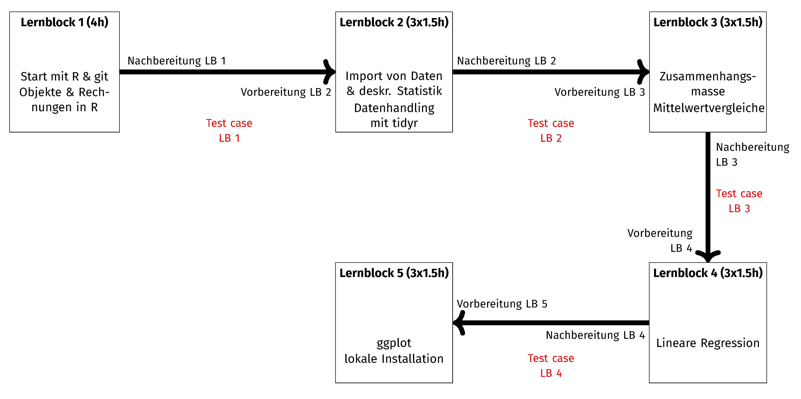

# Statistik+: Einstieg in R leicht gemacht
#### Ein überarbeiteter und neu-ausgerichteter Kurs für die Einführung in R als Start in die empirische Datenanalyse

## Projektziel
In diesem Projekt wird ein neuer Einführungskurs in R konzipiert, der Studierenden ohne tiefe Computer-/IT-Kenntnisse den Einstieg in R erleichtern soll (neue Kursstruktur, Kursmaterialien sowie erweiterte Lernmaterialien). Der neue Kurs hat das Ziel Studierende stärker in die Programmiersprache/-logik einzuführen, damit Studierende einen besseren Lernerfolg haben und besser motiviert für das Lernen sind. Ebenso ermöglicht es Studierenden dann, nachfolgend selbst weiterführenede Methoden zu lernen oder weiterführende Methodenkurse im Master zu wählen. Neben dieser Fokussierung auf das Programmieren soll das Arbeiten in Teams sowie das Arbeiten in Projekten gefördert werden. Die Teilnehmenden arbeiten fortlaufend im Semester an einem spezifischen Datensatz und erkunden die einzelnen Programmierverfahren bzw. Methoden anhand ausgewählter Variablen. Dabei wird mithilfe der Verknüpfung zu gitlab eine automatisierte Kontrolle ermöglicht (*pipelines*), die den Studierenden als Programmier-Beginner nochmals den iterativen Prozess im Programmieren verdeutlicht (fortlaufendes *troubleshooting*).

Das Ziel sozialwissenschaftlicher Studiengänge ist die Vermittlung aktueller Softwarekenntnisse in der Anwendung empirischer Methoden. Moderne Programmiersprachen wie R bringen für Studierende den Vorteil mit, dass entgegen den Beschränkungen (z.B. in SPSS) eine Vielzahl an unterschiedlichen empirischen Methoden in dieser einen Programmiersprache umgesetzt werden kann. Im weiteren Verlauf des eigenen Studiums, eines konsekutiven Masterstudiengangs oder im Berufsleben können Studierende auf dieses Grundwissen der Programmiersprache aufbauen und anstatt sich in neue Programme für einzelne Methoden einarbeiten zu müssen, müssen nur neue *Vokabeln* in dieser Programmiersprache gelernt werden. RStudio bietet dabei eine GUI für u.a. die Programmiersprache R, wobei wir bei der ersten Durchführung eine RStudio Cloud Instanz genutzt haben. Der Vorteil von RStudio Cloud ist, dass kein:e Studierende:r Programme installieren muss und in RStudio Cloud Dozierende Instanzen vorbereiten können bzw. direkt in die Instanzen der Studierenden wechseln können (auch jenseits der Präsenz). Zusätzlich ermöglicht die Software RStudio die Nutzung modernen Kollaborationstools wie git, die das kollaborative Arbeiten an empirischen Projekten erleichtern. Diese Tools werden nicht nur im Forschungsumfeld, sondern auch im beruflichen Umfeld von statistischen Analysen und anderen Programmierkontexten eingesetzt. 

Im Rahmen des Projekts stehen die folgenden Punkte im Zentrum: 
1. Überarbeitung der Einstiegsphase: Sensibilisierung für Programmieren & Lernmotivation steigern
2. inhaltliche Verzahnung von einzelnen Programmierschritten im Rahmen von Projektarbeiten
3. Hinführung zu eigener Projektorganisation während des Semesters mithilfe von git
4. Vermittlung von Programmieren als iterativer Schritt

## Aufbau des Kurses
Dieser Kurs orientiert sich stärker an genereller Programmierlehre und an Beiträgen aus der Vermittlung angewandter Statistik bzw. Programmierung. Grundidee ist es, gebündelte Trainingszeiten in der Präsenz zu haben, aber gleichzeitig auch Selbstlernphasen (über die erstellten Lernbücher/*Web-Based-Trainings*). Das Format orientiert sich daher auch an *Flipped classroom*-Formaten. So wird in der Präsenzzeit ausschließlich die Anwendung fokussiert und somit steht auch genügend Zeit für das *troubleshooting* in der Präsenz zur Verfügung, die sonst in klassischen Formaten oft fehlt. Der Praxis-Gedanke steht also im Vordergrund. Des Weiteren kann über dieses angewandte (monatliches) \textit{Camp} die praktische Vermittlung und das praktische Arbeiten mit R stärker fokussiert werden. 

Der Kurs ist mit einem einführenden Block gestaltet, zu dem Studierende keine Inhalte vorbereiten, sondern nur nachbereiten müssen. Insgesamt gibt es fünf Lernblöcke:
1. Start in die angewandte Statistik: Programme, Datentypen, einfache Rechnungen, Datenerhebung & Datensatz
1. Datensatz-Handling & deskriptive Statistik
1. bivariate Verfahren 
1. lineare Regression
1. grafische Darstellungen & Übergang zur lokalen Installation

Zwischen den Lernblöcken steht Zeit zur Nach- und Vorbereitung des nächsten Lernblocks zur Verfügung. Ebenso sollen Studierende in Gruppenarbeiten Aufgaben zur Nachbereitung lösen, um so eine konstante Beschäftigung mit dem Lerninhalt und dem Programmieren zu erreichen. In der Anwendung an der JLU können Studierende diese Anwendungsprojekte automatisiert in gitlab (zeit-/ressourcenunabhängig) überprüfen lassen (siehe hierzu [CI in der Lehre](https://gitlab.ub.uni-giessen.de/bpkleer/using-ci-teaching)). Das **CI Teaching**-Projekt ist als git-submodule in diesem Projekt hinterlegt. 

Der Aufbau im Sommersemester 2022 sieht wie folgt aus:

## Nutzung des Ordners
In diesem Projekt werden alle Lehr- und Lernmaterial im Sinne von [OER](https://open-educational-resources.de) zur weiteren Verwendung (bitte Lizenz unten beachten) zur Verfügung gestellt. Die Materialien werden im Laufe des Sommersemesters 2022 vervollständigt. Die Lernbücher (*Web-Based-Trainings*) werden basierend auf dem [hugo-learn-theme](https://github.com/matcornic/hugo-theme-learn) erstellt. Alle Materialien (mit Ausnahme des Corporate Designs der JLU) können unter der unten angegebenen Lizenz weiterverwendet werden. 

## Projektförderung
Das Projekt wurde mit Mitteln zur Verbesserung der Qualität der Studienbedingungen und der Lehre (QSL) des Fachbereichs 03 der Justus-Liebig-Universität von Oktober 2021 bis September 2022 gefördert. Die Projektleitung haben Philipp Kleer und Simone Abendschön. Bei Fragen zum Projekt können Sie sich an [Philipp Kleer](mailto:philipp.kleer@sowi.uni-giessen.de) wenden. 

## Lizenz
Alle Textdokumente (.css-, .toml-, .md-, .html-, und .RMarkdown-Dateien) sowie Daten sind lizenziert unter einer <a rel="license" href="http://creativecommons.org/licenses/by-sa/4.0/">Creative Commons Namensnennung - Weitergabe unter gleichen Bedingungen 4.0 International Lizenz (CC-BY-SA 4.0)</a>. 

Bitte beachten Sie, dass Logos der JLU sowie das [hugo-learn-theme](https://github.com/matcornic/hugo-theme-learn) nicht unter diese Lizenz fallen. Die Verwendung des Logos im Sinne des Corporate Designs ist nur Mitgliedern und Repräsentanten der JLU erlaubt. Weitere Hinweise zur Nutzung des JLU Logos finden Sie [hier](https://www.uni-giessen.de/ueber-uns/pressestelle/service/cd/cd_jlu_intern).
