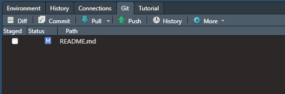

---
output:
  xaringan::moon_reader:
    lib_dir: libs
    css: ["../assets/xaringantheme-jlu.css"]  #Style sheet
    nature:
      beforeInit: "../assets/macros.js"  # individual macros
      seal: false  # no automatic title slide
      highlightStyle: github
      highlightLines: true
      highlightLanguage: ["r"]
      countIncrementalSlides: false  # incremental does not count as single slide 
      ratio: '16:9'  
      slideNumberFormat: |   # progress bar instead of slide numbers
        <div class="progress-bar-container">
          <div class="progress-bar" style="width: calc(%current% / %total% * 100%);">
          </div>
        </div>    
      navigation:
        scroll: false  #mouse scroll off (otherwise copying code is difficult)
---
```{r setup, include=FALSE}
library("knitr")  
library("rmarkdown")
library("tidyverse")
library("DT")  # Table illustration
library("icons")  # Social Media Links
icons::download_fontawesome()
library("RefManageR") # Zitation
library("xaringanBuilder") # Export
library("xaringanExtra") # some extras (panels, copyable code, etc.)

# Code Options
opts_chunk$set(fig.path = "./img/", # path for calculated figures
               fig.align = "center",  # alignment of figure (also possible right, left, default)
               fig.show = "hold", # how to show figures: hold -> direct at the end of code chunk; animate: all plots in an animation
               out.width = "50%",
               echo = TRUE,     # Code is printed
               eval = FALSE,    # Code is NOT evaluated
               warning = FALSE, # warnings are NOT displayed
               message = FALSE, # messages are NOT displayed
               background = "#E7E7E7", # background color of code chunks
               comment = "", # no hashtags before output
               results = "markdown",
               rows.print = 15
)

# data table options
options(DT.options = list(pageLength = 5,
                          language = list(search = 'Filter:'),
                          autowidth = TRUE,
                          lengthChange = FALSE,
                          formatStyle = (fontSize = "40%"))
        )

# copyable code
htmltools::tagList(
  xaringanExtra::use_clipboard(
    button_text = "<i class=\"fa fa-clipboard\"></i>",
    success_text = "<i class=\"fa fa-check\" style=\"color: #90BE6D\"></i>",
    error_text = "<i class=\"fa fa-times-circle\" style=\"color: #F94144\"></i>"
  ),
  rmarkdown::html_dependency_font_awesome()
)

# Referenzen
BibOptions(
  check.entries = FALSE, 
  bib.style = "authoryear", 
  cite.style = "authoryear", 
  style = "markdown",
  hyperlink = FALSE, 
  dashed = FALSE
)

lit = ReadBib("../assets/lit.bib")

# Suche
xaringanExtra::use_search(
  show_icon = FALSE,
  auto_search = TRUE,
  position = "top-right"
  )

income <- rnorm(1000, mean = 3975, sd = 500)
df <- as.data.frame(cbind(income))

# emoji addings
library("emoji")
```

# Bevor wir anfangen:

Folge den Instruktionen in der E-Mail vom Anfang der Woche:

[] Login mit s-/j-/n-Kennung in ...

[] Login mit s-/j-/n-Kennung in ...

[] Survey ausfüllen

[] 3 Einladungen zu gitlab annehmen

---

class: title, center, middle

# Statistik<sup>+</sup>: Einstieg in R leicht gemacht!

## Camp 1 

### Philipp Kleer | Institut für Politikwissenschaft | FB 03 | Sommersemester 2022

<!--- Social Media Links, müssen angepasst werden -->
.social[
[`r icons::icon_style(fontawesome("envelope"), scale = 1.5)`](mailto:philipp.kleer@sowi.uni-giessen.de)     [`r icons::icon_style(fontawesome("orcid"), scale = 1.5)`](https://orcid.org/0000-0003-1935-387X)     [`r icons::icon_style(fontawesome("gitlab"), scale = 1.5)`](https://gitlab.ub.uni-giessen.de/bpkleer)     [`r icons::icon_style(fontawesome("university"), scale = 1.5)`](https://www.uni-giessen.de/faculties/f03/departments/dps/staff/researchers/kleer?set_language=en)     [`r icons::icon_style(fontawesome("researchgate"), scale = 1.5)`](https://www.researchgate.net/profile/Benedikt_Kleer)
] 

---

# Was auf Sie zu kommt!
.pull-left-70[
.pull-left[
.center[

]
- Programmiersprache

- GNU-Projekt, daher frei erweiterbar, kostenlos und durch die Community immer up-to-date (neuere Methoden etc.)
]

.pull-right[
.center[

]
- Software, in der wir R benutzen

- *Integrated Development Environment* (IDE)

- wir nutzen Cloud-Version (über Uni lizenziert): Zugriff einfach aus dem Browser heraus (keine Installation notwendig )

- in der Einzelanwenderlizenz kostenlos (also auch Installation am eigenen Rechner möglich)

]
]

--

.pull-right-30[
.center[
 
]

- sogenannte *Version Control*

- erleichtert die gemeinsame Arbeit (kollaborativ) an Programm-Code

- erspart eine Menge Zeit an Datei-Management/-Versand, so dass wir die Zeit wirklich fürs Programieren/Lernen nutzen können (bzw. auf Dozentensicht für's Lehren)
]
 
---

class: section, mline, center, middle

# Gibt es Rückfragen zu den Formalia?

---

# Basics Computer: Dateien & Dateipfade

Was sind Dateien? 
--

- Inhalt, der in einem bestimmten Format gespeichert ist und von spezifischen Programmen gelesen werden kann

- Beispiel: semesterplan**.pdf** oder script1**.html**

--

Was für eine Endung hat eine Bilddatei zum Beispiel? Welche Endung hat eine Word-Datei?

--

- Bilddatei: **.png**, **.jpeg** ...

- Word-Datei: **.docx**, **.doc**

--

Wo werden Dateien gespeichert?

--
- Dateien werden lokal gespeichert und haben eine spezifische Adresse!

---

# Basics: Dateipfade

.center[

]
---

class: section, mline, center, middle

# Fangen wir mit dem Coden an!

---

# Einstieg in RStudio

Gehe auf RStudio und logge dich ein!


???
zeigen was beim Login passiert.

Aufteilung erklären im Stil (Was ist Console, Was ist ) in **firststeps**

Erstmal fokussieren auf die drei Sachen: Console, Files, Environment

Screenshots siehe Desktop Folder Statsplus-Screenshots

---

# Konsole

In der Konsole kann man direkt Anweisungen eingeben. 

R ist eine Rechensprache! Gib einfach mal `3 + 4` in die Konsole ein. Mit `Enter` führst du den Befehl in der Konsole aus. 

--

**Problem hierbei:** Um das Ergebnis aufzurufen, muss man immer wieder die Rechnung eingeben. Das ist lästig.

--

**Lösung**: Objekt speichern

???
 
in Konsole einfache Rechnung ausführen: `3 + 4`

Das heißt in der Konsole können wir Code einfach ausführen.

---

# Objekte

Was ist ein Objekt?

--

Ein Objekt ist ein beliebig benanntes Ergebnis oder Anweisung, die wir speichern können. 

Um eine Anweisung in R zu machen, nutzt du den `<-` (Anweisungspfeil). Warum geht der Pfeil in diese Richtung?

```{r object1, eval=TRUE}
math <- 2 + 3
```

--

Links steht das Objekt und rechts die Anweisung. Und die Anweisung geht zum Objekt! Für den Anweisungspfeil gibt es Shortcuts: `Alt` + `I` (Windows), `Option` + `I` (Mac).     

Was fällt dir auf?

--

Das Ergebnis wird nicht angezeigt. Korrekt, denn wir haben nur ein Objekt gespeichert. Um jetzt auf das Objekt zuzugreifen (bzw. den Inhalt im Objekt), musst du das Objekt aufrufen. 

--

Aber was könnte jetzt noch ein **Problem** sein?

--

Es gibt keine Möglichkeit den Code nachzuverfolgen. Die Konsole kann nicht gespeichert werden. 

---

# Skript anstatt Konsole

In Skripten kann Code gespeichert werden und so für sich selbst oder andere gespeichert werden. 

Warum könnte es relevant sein, dass wir das, was wir gemacht haben, in einer Datei speichern (und anderen zur Verfügung stellen können)?

--

- Nachbearbeitung, Teilen unserer Arbeit, Transparenz unserer Arbeit!

Ein neues **Skript** öffnest du über `File -> New File -> New R Script` oder mit dem Shortcut `Strg`+ `Shift` + `N` (Windows) oder `Cmd` + `Shift` + `N` (Mac). 

--

Welche Endung hat die Datei?

--

**.R** $\Rightarrow$ weil die Sprache des Skripts eben R ist!

--

Schreib den Code aus der Konsole nochmals ins Skript und führe den Code aus. Wie kannst du den Code ausführen?

--

Zeilen markieren oder Cursor in die Zeile stellen und `Strg + Enter` bzw. `Cmd + Enter`

???
neue Datei: Auf save button klicken und datei speichern. 
Wie führt man Code aus? Sie spielen lassen!

---

# Zwischenaufgabe

1. Führe eine Berechnung aus, die eine Multiplikation und Addition beinhaltet und als Ergebnis 20 hat. 

2. Speichere eine weitere Rechnung im Objekt `result`, das nur aus einer Subtraktion besteht und als Ergebnis 17 hat. 

Schreib beides in dein Skript!

---

# Was haben wir bisher geschafft?

Du hast die ersten Schritte in der Sprache R gelernt und kannst einfache Rechnungen ausführen. 

Du weißt wie du Objekte speicherst und wie du diese aufrufen kannst!

Wir wollen aber nicht nur einfache Rechnungen ausführen, sondern mit Surveydaten arbeiten.

--

**Next step: Welche Form können Daten haben?**

---

# 4 Wertetypen

Es gibt vier Wertetypen, die genutzt werden können:

- numeric (*numerisch*)

- integer (*ganzzahlig*)

- character/string (*Zeichen*)

- logical/boolean (*binär*: `TRUE`/`FALSE`)

???

Beispiel an der Tafel (jeweils mehrere Werte):

Wohnort

Alter

beantwortung Likert-Skala: trifft nicht zu <-> trifft voll zu

---

# Zwischentask

1. Speicher ein neues Objekt `ganzzahl`, das eine ganze Zahl beinhaltet.

2. Speicher ein neues Objekt `reell`, das eine Dezimalzahl beinhaltet.

3. Speicher ein neues Objekt `word`, dass ein beliebiges Wort beinhaltet.

???

1. Speicher ein neues Objekt `ganzzahl`, das eine ganze Zahl beinhaltet.

2. Speicher ein neues Objekt `reell`, dass eine reelle Zahl (aber nicht ganzzahlig) beinhaltet.
Lernziel: Punkt statt Komma als Dezimaltrennzahl!

3. Speicher ein neues Objekt `word`, dass ein beliebiges Wort beinhaltet.
Lernziel: Anführungsstriche für Text

---

# Mehr als ein Wert in Objekt speichern!

Um mehrere Werte in einem Objekt zu speichern, nutzt du deine erste **Funktion** in R. Mit der Funktion `c()` (*combine*) können wir mehr als einen Wert speichern! Funktionen erkennst du daran, dass eine Klammer folgt, der Argumente der Funktion (komma-getrennt) sind. 

Speichere **5** Werte im Objekte `fuenfWerte` mit der Funktion `c()`.

--

Wir erhalten dann einen Vektor! Daher lernen wir jetzt was über Datentypen in R!

---

# Vier Datentypen

- Vektoren (mehrere Werte in einem Objekt, z.B. genutzt für Variablen)
 
- Faktoren (Spezialform des Vektors für nominale Daten)

- Listen (Zusammenführung verschiedener anderer Objekt in einer Liste)

- Dataframes (spezielles Datenformat für Daten)

---

# Vektoren
.scrollable[
Wir haben das Alter von fünf Befragten und wollen das in einem Vektor `age` speichern.

Als Vektor würde dies wie folgt dargestellt: 

$$ age = \left(\begin{array}{c} 25, \\ 18, \\ 35, \\ 45, \\ 28 \end{array}\right) $$

Oder wir speichern den Wohnort von fünf Personen in einem Vektor `town`:

$$ town = \left(\begin{array}{c} Rio \, de \, Janeiro, \\ Salvador, \\ Salvador, \\ Belo \, Horizonte, \\ Belo \, Horizonte \end{array}\right) $$
Jetzt speichern wir das in R


```{r combined-vectors, eval=TRUE, echo=TRUE}
age <- c(
  25, 
  18, 
  35,
  45, 
  28
)

town <- c(
  "Rio de Janeiro",
  "Salvador",
  "Salvador", 
  "Belo Horizonte", 
  "Belo Horizonte"
)

``` 
]

---

# Werte in einem Vektor
Du weißt ja bereits wie du alle Werte eines Objekts aufrufst. Wie geht das nochmal?

--

Jetzt möchten wir einen einzigen Wert aus `age` ansprechen, nämlich den Wert der dritten befragten Person. 

--

In R werden Einschränkungen immer in `[...]` (eckige Klammern) gesetzt. Um also die Einschränkung zu setzen, dass nur der dritte Wert angezeigt werden soll, kannst du einfach `[3]` schreiben. Doch wo muss man das hinsetzen?

--

```{r limits, eval=FALSE, echo=TRUE}
age[3]
```

--

```{r limits2, eval=TRUE, echo=FALSE}
age[3]
```

---

# Faktoren

**Faktoren** sind ein spezielles Datenformat für nominale Daten. Dieses Datenformat ist später oft sinnvoll, wenn für eine Ausprägung mehrere Fälle auftreten (also wie bei `Salvador` oder `Belo Horizonte` in `town`).

--

Einen Faktor schafft man, in dem man auf den Vektor einfach die Funktion `as.factor()` anwendet:

```{r factor1, echo=TRUE, eval =FALSE}
as.factor(town)
```

--

```{r factor2, echo=FALSE, eval =TRUE}
as.factor(town)
```

Es gibt auch noch **ordered factors**, das lernst du in der Nachbearbeitung kennen.

---

# Dataframe

Ein **data frame** ist einfach ein Datensatz. Welche Konvention gilt für Datensätze?

--

column (*Spalte*): Variablen (in R: Vektoren oder Faktoren)


row (*Zeilen*): Beobachtungen (in R: Fälle)

--

Mehr zu Datensätze lernen wir in der Code-Challenge und im nächsten Lernblock kennen!

---

# Zwischenziel erreicht!

Du kanns jetzt nicht nur erste kleine Rechnungen in R ausführen, du kennst auch schon Wertetypen und Datentypen, die du anwenden kannst!

Nach der Pause machen wir noch etwas zur Einführung von gitlab!

---

class: section, mline, center, middle

# Git: Kollaborieren wie die Profis

---

# Was passiert oft in Projekten?
Nehmen wir ein einfaches Beispiel: Ihr arbeitet in einer Projektgruppe an einer empirischen Hausarbeit und schreibt auch Code. Ihr habt es bis zu einer finalen Version des Skripts geschafft und macht nun eine finale Kontrolle. 
 
--

```{tikz, process1, fig.ext = 'png', cache=TRUE, eval=TRUE, echo=FALSE}
\usetikzlibrary{positioning} 
\usetikzlibrary{calc}
\usetikzlibrary{decorations.pathreplacing}
\usetikzlibrary{shapes}
\usetikzlibrary{arrows.meta}
\tikzstyle{line} = [line width = 0.15cm, color = black!50, text = black, -{Triangle[scale = 0.6]}] % Global definitions for tikz}
\begin{tikzpicture}

	\node [circle, draw = gray, fill = gray, text = white] (a) at (0,5) {\Huge{\textbf{A}}};
	\node [circle, draw = orange, fill = orange, text = white] (b) at (-5,0) {\Huge{\textbf{B}}};
	\node [circle, draw =  cyan, fill =  cyan, text = white] (c) at (0,0) {\Huge{\textbf{C}}};
	\node [circle, draw = pink, fill = pink, text = white] (d) at (5,0) {\Huge{\textbf{D}}};	 
	
	\draw[->, line width=1.5mm, color = gray] (a) -- (b);	
	\draw[->, line width=1.5mm, color = gray] (a) -- (c);	
	\draw[->, line width=1.5mm, color = gray] (a) -- (d);	
	
	\node[rectangle, fill = white, text = gray] (f1) at (0, 2.5) {\Large{final.R}};

\end{tikzpicture}
```

---

# Was passiert oft in Projekten?
Dann behebt die eifrige Person C direkt noch Änderung und schickt es wieder an alle Personen der Gruppe.

```{tikz, process2, fig.ext = 'png', cache=TRUE, eval=TRUE, echo=FALSE}
\usetikzlibrary{positioning} 
\usetikzlibrary{calc}
\usetikzlibrary{decorations.pathreplacing}
\usetikzlibrary{shapes}
\usetikzlibrary{arrows.meta}
\tikzstyle{line} = [line width = 0.15cm, color = black!50, text = black, -{Triangle[scale = 0.6]}] % Global definitions for tikz}
\begin{tikzpicture}
	% Gruppenmitglieder
	\node [circle, draw = gray, fill = gray, text = white] (a) at (0,5) {\Huge{\textbf{A}}};
	\node [circle, draw = orange, fill = orange, text = white] (b) at (-5,0) {\Huge{\textbf{B}}};
	\node [circle, draw =  cyan, fill =  cyan, text = white] (c) at (0,0) {\Huge{\textbf{C}}};
	\node [circle, draw = pink, fill = pink, text = white] (d) at (5,0) {\Huge{\textbf{D}}};	 
	
	% first final version
	\draw[->, line width=1.5mm, color = gray] (a) -- (b);	
	\draw[->, line width=1.5mm, color = gray] (a) -- (c);	
	\draw[->, line width=1.5mm, color = gray] (a) -- (d);	
	\node[rectangle, fill = white, text = gray] (f1) at (0, 2.5) {\Large{final.R}};
	
	% second final version
	\draw[->, line width=1.5mm, color = cyan] (c) -- (b);	
	\draw[->, line width=1.5mm, color = cyan] (c) -- (d);	
	\draw[->, line width=1.5mm, color = cyan] (c) to [out= 45, in=295]  (a);	
	\node[rectangle, fill = white, text = cyan] (f2) at (2, 0.5) {\Large{finalC.R}};

\end{tikzpicture}
```

---

# Was passiert oft in Projekten?
Dann haben Person B und D auch Zeit und bearbeiten noch die finale Version. Person B verplant sich aber dabei und bearbeitete die von A geschickte Version. Person D bearbeitet die von C nochmals korrigierte Version. 
```{tikz, process3, fig.ext = 'png', cache=TRUE, eval=TRUE, echo=FALSE}
\usetikzlibrary{positioning} 
\usetikzlibrary{calc}
\usetikzlibrary{decorations.pathreplacing}
\usetikzlibrary{shapes}
\usetikzlibrary{arrows.meta}
\tikzstyle{line} = [line width = 0.15cm, color = black!50, text = black, -{Triangle[scale = 0.6]}] % Global definitions for tikz}
\begin{tikzpicture}
	% Gruppenmitglieder
	\node [circle, draw = gray, fill = gray, text = white] (a) at (0,5) {\Huge{\textbf{A}}};
	\node [circle, draw = orange, fill = orange, text = white] (b) at (-5,0) {\Huge{\textbf{B}}};
	\node [circle, draw =  cyan, fill =  cyan, text = white] (c) at (0,0) {\Huge{\textbf{C}}};
	\node [circle, draw = pink, fill = pink, text = white] (d) at (5,0) {\Huge{\textbf{D}}};	 
	
	% first final version
	\draw[->, line width=1.5mm, color = gray] (a) -- (b);	
	\draw[->, line width=1.5mm, color = gray] (a) -- (c);	
	\draw[->, line width=1.5mm, color = gray] (a) -- (d);	
	\node[rectangle, fill = white, text = gray] (f1) at (0, 2.5) {\Large{final.R}};
	
	% second final version
	\draw[->, line width=1.5mm, color = cyan] (c) -- (b);	
	\draw[->, line width=1.5mm, color = cyan] (c) -- (d);	
	\draw[->, line width=1.5mm, color = cyan] (c) to [out= 45, in=295]  (a);	
	\node[rectangle, fill = white, text = cyan] (f2) at (2, 0.5) {\Large{finalC.R}};
	
	% third final version
	\draw[->, line width=1.5mm, color = orange] (b)  to [out= 90, in=180] (a);	
	\draw[->, line width=1.5mm, color = orange] (b)  to [out= 315, in=225] (c);	
	\draw[->, line width=1.5mm, color = orange] (b) to [out= 300, in=250]  (d);	
	\node[rectangle, text = orange] (f3) at (-2.5, -0.75) {\Large{finalB.R}};
	
	% fourth final version
	\draw[->, line width=1.5mm, color = pink] (d)  to [out= 90, in=0] (a);	
	\draw[->, line width=1.5mm, color = pink] (d)  to [out= 280, in=280] (b);	
	\draw[->, line width=1.5mm, color = pink] (d) to [out= 225, in=315]  (c);	
	\node[rectangle, fill = white, text = pink] (f4) at (6.25, 2) {\Large{finalCD.R}};
\end{tikzpicture}
```
---

# Was passiert oft in Projekten?

Man kann das noch weiterspinnen, was aber klar wird: Es ist ein reines **Chaos** und es fällt schwer den Überblick zu behhalten. 

--

Auch Tools wie JLUbox oder Dropbox sind nur eingeschränkt sinnvoll, da auch hier die synchrone Bearbeitung oftmals zu Problemen führt.

--

`r icons::icon_style(fontawesome("arrow-circle-right"), fill = "#0069B3")` deshalb 

---

# Was macht also  ?
- **Git** ist eine *Version*-Control: Anwendung in Forschung als auch in IT-Unternehmen
--

- Ziel ist Änderungen in textbasierten Dateien nachverfolgen zu können, also z.B. in Skripten (`.r`, `.rmd`, oder `.md`)
--

- es können verschiedene Personen auch zeitgleich an Dateien arbeiten
--

- Nutzende bearbeiten Dateien lokal, bestätigen ihre Änderungen und senden diese dann an den Server
--

- **Git** speichert die Änderungen und synchronisiert die Datei mit Änderungen von anderen
--


`r icons::icon_style(fontawesome("arrow-circle-right"), fill = "#0069B3")` Es besteht also global immer nur eine Datei, die aber alle Änderungen nachverfolgbar dokumentiert!

---


# Wie wendet man git an?
Es gibt verschiedene Serverlösungen, die auf git beruhen. Dies sind unter anderem **Gitlab**, **Github** (`r emoji("unamused")` wurde von Microsoft aufgekauft) oder auch **Bitbucket**. An der JLU gibt es eine Distribution von [JLU Gitlab](https://gitlab.ub.uni-giessen.de), auf der man sich mit seiner s-/j-/g-Kennung einloggen kann. 

--

Um git verwenden zu können, muss man ein paar Vokabeln verstehen. Diese reichen aber für die Grundlagen vollkommen aus. Um in **Git** arbeiten zu können, muss man ein paar Vokabeln üben. 

--

- Repository (lokal und global (*server-side*))
- Group
- commit
- pull
- push

---

# Repository
.font80[
Ein **Repository** (in Gitlab: **Project**) ist wie ein Ordner in der JLUBox oder DropBox. **Repositories** sind durch **Git** synchronisiert und die Versionsverläufe können nachverfolgt werden. Ein **Repository** ist also eine Sammlung von Dateien, deren Bearbeitungsverlauf in Schnappschüssen versioniert wird. Mit **Git** kann man beliebig viele unterschiedliche Repositories verwalten.
]
--
.font80[
Ein **Git-repository** sind z.B. die Kursmaterialien [course-materials](https://gitlab.ub.uni-giessen.de/intro-r-spring22/course-materials). Dieses **Repository** beinhaltet die Kursmaterialien zum Kurs. Dies ist die globale Version (*server-side*), die auf **JLU Gitlab** gehostet wird. Man kann die Dateien auf dem Server direkt bearbeiten, das macht man aber in der Regel nicht. Im Üblichen **cloned** man das **Repository** in einen lokalen Ordner, verändert dort die Dateien (in entsprechenden Programmen) und sendet dann die Änderungen an den Server zurück.
]
--
.font80[
.pull-left[
Ein lokales Repository ist einfach ein Ordner, der neben den Dateien einen versteckten Ordner `.git` enthält. In diesem ist hinterlegt, dass dieser Ordner mit einer Server-Version verknüpft ist. 
]
]
 
.pull-right[
.center[

]
]
---

# Group 
Eine **Group** in **Gitlab** ist einfach eine Sammlung verschiedener Repositories oder **Subgroups** in einer Gruppe. Somit lassen sich größere Projekte besser verwaltem. So ist z.B. der [Kurs im Sommersemester](https://gitlab.ub.uni-giessen.de/intro-r-spring21) eine solche Gruppe, in der es **Subgroups** und Repositories gibt: `effie` bis `rue` und `course-materials`. Eine **Subgroup** ist einfach nur eine Gruppe innerhalb einer Gruppe. 

.center[

]
---

# Commit 
.font90[
In RStudio haben wir bereits die Verbindung zur globalen Version für dich hergestellt (**clonen**), darum musst du dich nicht mehr kümmern. Jetzt musst du nur noch lernen, wie du die Änderungen auf deine Version holst bzw. wie du selbst Änderungen abschickst (Gruppenabgaben). Wenn man Änderungenan den Server schicken und allen sichtbar machen, macht man folgenden Dreischritt: **commit**, **pull** & **push**. Will man Änderungen nur erhalten, reicht ein Zweischritt: **commit** & **pull**.
]
--
.font90[
Mit **commit** als ersten Schritt geben wir **Git** an, dass die Änderungen, die wir gemacht haben, registriert und nicht überspeichert werden sollen. Dazu gehst du im **Environment** auf den Tab **Git**. Du siehst direkt die drei Buttons. Wenn es bereits Änderungen gibt, sind diese hier aufgelistet. Falls nichts geändert wurde, erscheint auch nichts und du kannst nicht **committen**.
]

.center[

]

---

# Commit

.pull-left[
Wenn man etwas an den Dateien bearbeitet und die Datei gespeichert hat, wird im Reiter **git** sichtbar, dass man diese Datei bearbeitet hat (hier `M` für *modified*)
]

.pull-right[
.center[

]
]

--

Wenn man nach Änderungen nun auch **Commit** klickt, öffnet sich ein neues Fenster. 

--

.pull-left[
Hier wird angezeigt, welche Datei *modified* wurde, oder z.B. gelöscht (*deleted*) oder hinzugefügt (*added*). Um diese Dateien zu committen, muss einfach ein Haken neben der Datei gesetzt werden. Anschliessend gibt man eine *Commit message* ein und klickt anschließend auf *commit*. Wenn man eine Datei angeklickt hat, sieht man auch im unteren Feld, was in der Datei geändert wurde. 

]


.pull-right[
.center[

]
]

??? 

Mit denen einmal vormachen mit course materials!
---

# `course-materials`

Im Projekt `course-materials` kannst du nur Änderungen holen, nicht deine Änderungen abschicken. 

Hier werden nach und nach immer die aktuellen Kursmaterialien zur Verfügung gestellt. 

Also hier kannst du nur **commit** & **pull** machen. 

---

# Gruppenprojekte `effie`, `katniss`, `gale`, `peta` & `rue` 
In RStudio gibt es für jede Gruppe ein Projekt. Wie auch schon bei den anderen beiden Projekten `course-materials` und `firststeps` musst du nach dem ersten Öffnen eine eigene Kopie speichern. 

--

Es hat also jede Person aus der Gruppe einen eigene Kopie. Über **gitlab** könnt ihr euren Code dann untereinander austauschen. Hier muss man jetzt den **Dreischritt** (*commit*, *pull*, *push*) anwenden. 
 
--

Wenn wir bearbeitete Dateien an den Server schicken wollen, führen wir zuerst **commit** aus. Mit **pull** ziehen wir die aktuellste Version vom Server auf RStudio Cloud. **Wichtig:** Man muss vorher seine lokalen Änderungen mit **commit** speichern. **Pull** vor **Push** ist wichtig, da ja auch andere Personen an den Dateien arbeiten und evtl. ist die eigene lokale Version gar nicht mehr die aktuellste. Wenn man das vergisst, kann es zum **merge error** kommen (dann bei uns melden!). Nachdem man dann die eigenen Änderungen committed hat, und die aktuellste Version gepulled hat, kann man seine Bearbeitung pushen. 

---

class: goodbye, center, middle

# Wir sehen uns in 3 Wochen!

.social[
[`r icons::icon_style(fontawesome("envelope"), scale = 1.5)`](mailto:philipp.kleer@sowi.uni-giessen.de)     [`r icons::icon_style(fontawesome("orcid"), scale = 1.5)`](https://orcid.org/0000-0003-1935-387X)     [`r icons::icon_style(fontawesome("gitlab"), scale = 1.5)`](https://gitlab.ub.uni-giessen.de/bpkleer)     [`r icons::icon_style(fontawesome("university"), scale = 1.5)`](https://www.uni-giessen.de/faculties/f03/departments/dps/staff/researchers/kleer?set_language=en)     [`r icons::icon_style(fontawesome("researchgate"), scale = 1.5)`](https://www.researchgate.net/profile/Benedikt_Kleer)
] 