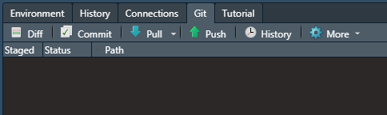

```{r setup, include=FALSE}
library("knitr")  
library("rmarkdown")
library("tidyverse")
library("DT")  # Table illustration
library("icons")  # Social Media Links
library("RefManageR") # Zitation
library("xaringanBuilder") # Export
library("xaringanExtra") # some extras (panels, copyable code, etc.)

# Code Options
opts_chunk$set(fig.path = "assets/createdpics/", # path for calculated figures
               fig.align = "center",  # alignment of figure (also possible right, left, default)
               fig.show = "hold", # how to show figures: hold -> direct at the end of code chunk; animate: all plots in an animation
               out.width = "50%",
               echo = TRUE,     # Code is printed
               eval = FALSE,    # Code is NOT evaluated
               warning = FALSE, # warnings are NOT displayed
               message = FALSE, # messages are NOT displayed
               background = "#E7E7E7", # background color of code chunks
               comment = "", # no hashtags before output
               results = "markdown",
               rows.print = 15
)

# data table options
options(DT.options = list(pageLength = 5,
                          language = list(search = 'Filter:'),
                          autowidth = TRUE,
                          lengthChange = FALSE,
                          formatStyle = (fontSize = "40%"))
        )

# copyable code
htmltools::tagList(
  xaringanExtra::use_clipboard(
    button_text = "<i class=\"fa fa-clipboard\"></i>",
    success_text = "<i class=\"fa fa-check\" style=\"color: #90BE6D\"></i>",
    error_text = "<i class=\"fa fa-times-circle\" style=\"color: #F94144\"></i>"
  ),
  rmarkdown::html_dependency_font_awesome()
)

# Referenzen
BibOptions(
  check.entries = FALSE, 
  bib.style = "authoryear", 
  cite.style = "authoryear", 
  style = "markdown",
  hyperlink = FALSE, 
  dashed = FALSE
)

# lit = ReadBib("./assets/lit.bib")

# Suche
xaringanExtra::use_search(
  show_icon = FALSE,
  auto_search = TRUE,
  position = "top-right"
  )

# Clipboard
htmltools::tagList(
  xaringanExtra::use_clipboard(
    button_text = "<i class=\"fa fa-clipboard\"></i>",
    success_text = "<i class=\"fa fa-check\" style=\"color: #90BE6D\"></i>",
  ),
  rmarkdown::html_dependency_font_awesome()
)

# Datasets
income <- rnorm(1000, mean = 3975, sd = 500)
df <- as.data.frame(cbind(income))

# emoji addings
library("emoji")
# adding emojis by emoji("smile")
# getting list of emoji-names: emoji_name[1:10]

```

class: title, center, middle

# Version Control 

## Wie wir gemeinsam mit Dateien arbeiten können

### Philipp Kleer | Institut für Politikwissenschaft | FB 03 | Sommersemester 2022

<!--- Social Media Links, müssen angepasst werden -->
.social[
[`r icons::icon_style(fontawesome("envelope"), scale = 1.5)`](mailto:philipp.kleer@sowi.uni-giessen.de)     [`r icons::icon_style(fontawesome("orcid"), scale = 1.5)`](https://orcid.org/0000-0003-1935-387X)     [`r icons::icon_style(fontawesome("gitlab"), scale = 1.5)`](https://gitlab.ub.uni-giessen.de/bpkleer)     [`r icons::icon_style(fontawesome("university"), scale = 1.5)`](https://www.uni-giessen.de/faculties/f03/departments/dps/staff/researchers/kleer?set_language=en)     [`r icons::icon_style(fontawesome("researchgate"), scale = 1.5)`](https://www.researchgate.net/profile/Benedikt_Kleer)
] 

---

# Was passiert oft in Projekten?
Nehmen wir ein einfaches Beispiel: Ihr arbeitet in einer Projektgruppe an einer empirischen Hausarbeit und schreibt auch Code. Ihr habt es bis zu einer finalen Version des Skripts geschafft und macht nun eine finale Kontrolle. 
 
--

```{tikz, process1, fig.ext = 'png', cache=TRUE, eval=TRUE, echo=FALSE}
\usetikzlibrary{positioning} 
\usetikzlibrary{calc}
\usetikzlibrary{decorations.pathreplacing}
\usetikzlibrary{shapes}
\usetikzlibrary{arrows.meta}
\tikzstyle{line} = [line width = 0.15cm, color = black!50, text = black, -{Triangle[scale = 0.6]}] % Global definitions for tikz}
\begin{tikzpicture}

	\node [circle, draw = gray, fill = gray, text = white] (a) at (0,5) {\Huge{\textbf{A}}};
	\node [circle, draw = orange, fill = orange, text = white] (b) at (-5,0) {\Huge{\textbf{B}}};
	\node [circle, draw =  cyan, fill =  cyan, text = white] (c) at (0,0) {\Huge{\textbf{C}}};
	\node [circle, draw = pink, fill = pink, text = white] (d) at (5,0) {\Huge{\textbf{D}}};	 
	
	\draw[->, line width=1.5mm, color = gray] (a) -- (b);	
	\draw[->, line width=1.5mm, color = gray] (a) -- (c);	
	\draw[->, line width=1.5mm, color = gray] (a) -- (d);	
	
	\node[rectangle, fill = white, text = gray] (f1) at (0, 2.5) {\Large{final.R}};

\end{tikzpicture}
```

---

# Was passiert oft in Projekten?
Dann behebt die eifrige Person C direkt noch Änderung und schickt es wieder an alle Personen der Gruppe.

```{tikz, process2, fig.ext = 'png', cache=TRUE, eval=TRUE, echo=FALSE}
\usetikzlibrary{positioning} 
\usetikzlibrary{calc}
\usetikzlibrary{decorations.pathreplacing}
\usetikzlibrary{shapes}
\usetikzlibrary{arrows.meta}
\tikzstyle{line} = [line width = 0.15cm, color = black!50, text = black, -{Triangle[scale = 0.6]}] % Global definitions for tikz}
\begin{tikzpicture}
	% Gruppenmitglieder
	\node [circle, draw = gray, fill = gray, text = white] (a) at (0,5) {\Huge{\textbf{A}}};
	\node [circle, draw = orange, fill = orange, text = white] (b) at (-5,0) {\Huge{\textbf{B}}};
	\node [circle, draw =  cyan, fill =  cyan, text = white] (c) at (0,0) {\Huge{\textbf{C}}};
	\node [circle, draw = pink, fill = pink, text = white] (d) at (5,0) {\Huge{\textbf{D}}};	 
	
	% first final version
	\draw[->, line width=1.5mm, color = gray] (a) -- (b);	
	\draw[->, line width=1.5mm, color = gray] (a) -- (c);	
	\draw[->, line width=1.5mm, color = gray] (a) -- (d);	
	\node[rectangle, fill = white, text = gray] (f1) at (0, 2.5) {\Large{final.R}};
	
	% second final version
	\draw[->, line width=1.5mm, color = cyan] (c) -- (b);	
	\draw[->, line width=1.5mm, color = cyan] (c) -- (d);	
	\draw[->, line width=1.5mm, color = cyan] (c) to [out= 45, in=295]  (a);	
	\node[rectangle, fill = white, text = cyan] (f2) at (2, 0.5) {\Large{finalC.R}};

\end{tikzpicture}
```

---

# Was passiert oft in Projekten?
Dann haben Person B und D auch Zeit und bearbeiten noch die finale Version. Person B verplant sich aber dabei und bearbeitete die von A geschickte Version. Person D bearbeitet die von C nochmals korrigierte Version. 
```{tikz, process3, fig.ext = 'png', cache=TRUE, eval=TRUE, echo=FALSE}
\usetikzlibrary{positioning} 
\usetikzlibrary{calc}
\usetikzlibrary{decorations.pathreplacing}
\usetikzlibrary{shapes}
\usetikzlibrary{arrows.meta}
\tikzstyle{line} = [line width = 0.15cm, color = black!50, text = black, -{Triangle[scale = 0.6]}] % Global definitions for tikz}
\begin{tikzpicture}
	% Gruppenmitglieder
	\node [circle, draw = gray, fill = gray, text = white] (a) at (0,5) {\Huge{\textbf{A}}};
	\node [circle, draw = orange, fill = orange, text = white] (b) at (-5,0) {\Huge{\textbf{B}}};
	\node [circle, draw =  cyan, fill =  cyan, text = white] (c) at (0,0) {\Huge{\textbf{C}}};
	\node [circle, draw = pink, fill = pink, text = white] (d) at (5,0) {\Huge{\textbf{D}}};	 
	
	% first final version
	\draw[->, line width=1.5mm, color = gray] (a) -- (b);	
	\draw[->, line width=1.5mm, color = gray] (a) -- (c);	
	\draw[->, line width=1.5mm, color = gray] (a) -- (d);	
	\node[rectangle, fill = white, text = gray] (f1) at (0, 2.5) {\Large{final.R}};
	
	% second final version
	\draw[->, line width=1.5mm, color = cyan] (c) -- (b);	
	\draw[->, line width=1.5mm, color = cyan] (c) -- (d);	
	\draw[->, line width=1.5mm, color = cyan] (c) to [out= 45, in=295]  (a);	
	\node[rectangle, fill = white, text = cyan] (f2) at (2, 0.5) {\Large{finalC.R}};
	
	% third final version
	\draw[->, line width=1.5mm, color = orange] (b)  to [out= 90, in=180] (a);	
	\draw[->, line width=1.5mm, color = orange] (b)  to [out= 315, in=225] (c);	
	\draw[->, line width=1.5mm, color = orange] (b) to [out= 300, in=250]  (d);	
	\node[rectangle, text = orange] (f3) at (-2.5, -0.75) {\Large{finalB.R}};
	
	% fourth final version
	\draw[->, line width=1.5mm, color = pink] (d)  to [out= 90, in=0] (a);	
	\draw[->, line width=1.5mm, color = pink] (d)  to [out= 280, in=280] (b);	
	\draw[->, line width=1.5mm, color = pink] (d) to [out= 225, in=315]  (c);	
	\node[rectangle, fill = white, text = pink] (f4) at (6.25, 2) {\Large{finalCD.R}};
\end{tikzpicture}
```
---

# Was passiert oft in Projekten?

Man kann das noch weiterspinnen, was aber klar wird: Es ist ein reines **Chaos** und es fällt schwer den Überblick zu behhalten. 

--

Auch Tools wie JLUbox oder Dropbox sind nur eingeschränkt sinnvoll, da auch hier die synchrone Bearbeitung oftmals zu Problemen führt.

--

`r icons::icon_style(fontawesome("arrow-circle-right"), fill = "#0069B3")` deshalb 

---

# Was macht also  ?
- **Git** ist eine *Version*-Control: Anwendung in Forschung als auch in IT-Unternehmen
--

- Ziel ist Änderungen in textbasierten Dateien nachverfolgen zu können, also z.B. in Skripten (`.r`, `.rmd`, oder `.md`)
--

- es können verschiedene Personen auch zeitgleich an Dateien arbeiten
--

- Nutzende bearbeiten Dateien lokal, bestätigen ihre Änderungen und senden diese dann an den Server
--

- **Git** speichert die Änderungen und synchronisiert die Datei mit Änderungen von anderen
--


`r icons::icon_style(fontawesome("arrow-circle-right"), fill = "#0069B3")` Es besteht also global immer nur eine Datei, die aber alle Änderungen nachverfolgbar dokumentiert!

---


# Wie wendet man git an?
Es gibt verschiedene Serverlösungen, die auf git beruhen. Dies sind unter anderem **Gitlab**, **Github** (`r emoji("unamused")` wurde von Microsoft aufgekauft ) oder auch **Bitbucket**. An der JLU gibt es eine Distribution von [JLU Gitlab](https://gitlab.ub.uni-giessen.de), auf der man sich mit seiner s-/j-/g-Kennung einloggen kann. 

--

Um git verwenden zu können, muss man ein paar Vokabeln verstehen. Diese reichen aber für die Grundlagen vollkommen aus. Um in **Git** arbeiten zu können, muss man ein paar Vokabeln üben. 

--

- Repository (lokal und global (*server-side*))
- Group
- clone
- commit
- pull
- push
- branch

---

# Repository
.font80[
Ein **Repository** (in Gitlab: **Project**) ist wie ein Ordner in der JLUBox oder DropBox. **Repositories** sind durch **Git** synchronisiert und die Versionsverläufe können nachverfolgt werden. Ein **Repository** ist also eine Sammlung von Dateien, deren Bearbeitungsverlauf in Schnappschüssen versioniert wird. Mit **Git** kann man beliebig viele unterschiedliche Repositories verwalten.
]
--
.font80[
Ein **Git-repository** ist z.B. der [Workshop Tidyverse](https://gitlab.ub.uni-giessen.de/bpkleer/mtg21-tidyversek). Dieser beinhaltet die Kursmaterialien zum Workshop. Dies ist die globale Version (*server-side*), die auf **JLU Gitlab** gehostet wird. Man kann die Dateien auf dem Server direkt bearbeiten, das macht man aber in der Regel nicht. Im Üblichen **cloned** man das **Repository** in einen lokalen Ordner, verändert dort die Dateien (in entsprechenden Programmen) und sendet dann die Änderungen an den Server zurück.
]
--
.font80[
.pull-left[
Ein lokales Repository ist einfach ein Ordner, der neben den Dateien einen versteckten Ordner `.git` enthält. In diesem ist hinterlegt, dass dieser Ordner mit einer Server-Version verknüpft ist. 
]
]

.pull-right[
.center[

]
]
---

# Group 
Eine **Group** in **Gitlab** ist einfach eine Sammlung verschiedener Repositories in einer Gruppe. So ist z.B. der [Kurs im Sommersemester](https://gitlab.ub.uni-giessen.de/intro-r-spring21) eine solche Gruppe, in der es mehrere Repositories gibt: `group1` bis `group5` und `course-materials`.

.center[

]
---

# Clone 
Um nun Dateien lokal bearbeiten zu können, muss man die Server-Version lokal speichern und mit **Git** verknüpfen. Dies nennt man **clonen**, da man ein Spiegelbild der Server-Version lokal auf seinem Computer anlegt. 

--

Dies geht schnell über die Eingabeaufforderung (Windows) oder übers Terminal (Mac). Dazu navigiert man einfach in den Ordner, in dem man das *git repository* speichern möchte. In andere Ordner gelangt man mit dem Befehl `cd` (*change directory*). Ich speichere alle git-repositories in einem Ordner namens `gitlab` in `documents`. Hierbei muss beim Navigieren beachten, wo man startet und von dort den Weg über den `cd`-Befehl eingeben. Den Link zum Clonen muss man aus dem jeweiligen Projekt herauskopieren (Button Clone, https- oder ssh-Zugriff wählen)

```bash
cd documents/gitlab/
git clone https://gitlab.ub.uni-giessen.de/bpkleer/mtg21-tidyverse.git
```

---

# Commit 
.font90[
Nachdem man das Repository lokal gecloned hat, kann man die Dateien in dem Ordner bearbeiten. Will man diese neuen Versionen an den Server schicken und allen sichtbar machen, macht man folgenden Dreischritt: **commit**, **pull** & **push**.
]
--
.font90[
Mit **commit** als ersten Schritt geben wir **Git** an, dass die Änderungen, die wir gemacht haben, registriert und in die Server-Versionen hinzugefügt werden sollen Dazu müssen wir zwei Befehle per *Commandline* ausführen. **Wichtig**: Man muss direkt in dem Verzeichnis sein, der das Repository darstellt. In meinem Beispiel muss ich also in das Verzeichnis `mtg21-tidyverse` wechseln, in dem das Repository gecloned wurde. 

Mit `git add .` geben wir an, dass alle bearbeiteten Veränderungen in dem Ordner an den Server geschickt werden sollen. Mit `git commit` machen wir daraus eine neue Version und fügen mit `-m` und dem Text in Anführungsstrichen eine kurze Beschreibung hinzu. Jetzt muss man dies nur noch an den Server schicken!
]

--
 
```bash
cd mtg21-tidyverse
git add .
git commit -m "initial status"
```

---

# Pull & Push 
Wenn wir bearbeitete Dateien an den Server schicken wollen, führen wir zuerst *commit* aus. Anschließend führen wir **pull** aus und dann **push**.

Mit **pull** ziehen wir die aktuellste Version vom Server auf unser lokales Verzeichnis. **Wichtig:** Man muss vorher seine lokalen Änderungen mit commit speichern. **Pull** vor **Push** ist wichtig, da ja auch andere Personen an den Dateien arbeiten und evtl. ist die eigene lokale Version gar nicht mehr die aktuellste. Wenn man das vergisst, kann es zum **merge error** kommen. Nachdem man dann die eigenen Änderungen committed hat, und die aktuellste Version gepulled hat, kann man seine Bearbeitung pushen. 

--

```bash
git pull origin main 

git push origin main
```

---

# Integration in RStudio
In RStudio können auch direkt git-Repositories gecloned werden. Eventuell fällt dies dem einen oder anderen etwas leichter in der Handhabung. Dazu muss man über `File -> New Project` in RStudio ein neues Projekt erstellen. 

.pull-left[
### Schritt 1
Im Menü wählt man dann Version Control aus:
.center[

]
]

--

.pull-right[
### Schritt 2
Und dann wiederum Git:
.center[

]
]
---

# Integration in RStudio
.font90[
Dann gibt man die Daten des Projekts ein!

.pull-left[

### Schritt 1
*Repository URL*: Link aus gitlab (entweder HTTPS oder SSH)
### Schritt 2
*Project directory name*: meistens automatisch vom Link, kann aber abgeändert werden 
### Schritt 3
*Create project as subdirectory of*: Pfad, in dem das neue Verzeichnis erstellt wird. Kann über *Browse* geändert werden. 
]
]

.pull-right[
.center[

]
]
---

# Committen, Pullen & Pushen in RStudio
.font90[
Um das repository in RStudio korrekt handhaben zu können, muss man dann immer die Projekt-Datei aus dem Folder öffnen (`*.Rproj`).
]
--

.pull-left[
.font90[
Nach dem Öffnen der Projektdatei erscheint im Tab, in dem auch das *environment* ist, ein weiterer Reiter namens **Git**. Hier sehen wir auch die drei nötigen Befehle *commit*, *pull* und *push*. 
]
]


.pull-right[
.center[

]
]

--

.pull-left[
.font90[
Wenn man etwas an den Dateien bearbeitet und die Datei gespeichert hat, wird im Reiter **git** sichtbar, dass man diese Datei bearbeitet hat (*modified*)
]
]

.pull-right[
.center[

]
]

.font90[
Wie in der Eingabeaufforderung/Terminal auch, muss man nun zuerst *committen*, dann *pullen* und dann *pushen*.
]
---

# Committen, Pullen & Pushen in RStudio
Wenn man nach Änderungen nun auch **Commit** klickt, öffnet sich ein neues Fenster. 

--

.pull-left[
Hier wird angezeigt, welche Datei *modified* wurde, oder z.B. gelöscht (*deleted*) oder hinzugefügt (*added*). Um diese Dateien zu committen, muss einfach ein Haken neben der Datei gesetzt werden. Anschliessend gibt man eine *Commit message* ein und klickt anschließend auf *commit*. Wenn man eine Datei angeklickt hat, sieht man auch im unteren Feld, was in der Datei geändert wurde. 

]


.pull-right[
.center[

]
]

--

Nachdem man dann committed hat, drückt man einmal **Pull**, um die derzeit aktuellste Version zu laden und anschließend pusht man seine Änderungen an den Server, in dem man auf **Push** drückt. 

---

# Branch
Ein **branch** ist eine Abzweigung in einem Repository. Manche repositories sind so eingestellt, dass jede Person im Repository auf ihrem eigenen **branch** arbeitet und dann am Ende alles final zusammengefügt wird. 

--

Ein neuer Branch kann im entsprechenden Verzeichnis ganz leicht erstellt werden:
```bash
cd documents/gitlab/mtg21-tidyverse
git branch phil
```
--

Um dann in diesem Branch zu arbeiten, muss man in diesen wechseln:
```bash
git checkout phil
```

Mit diesem Befehl kann man in alle Branches wechseln. 
---

# Branch in RStudio
In RStudio kann man einfach in dem Reiter **git** in andere Branches wechseln oder auch neue schaffen.

.center[

]
--
 
Hier gibt es jetzt bisher nur den **main**-Branch (den gibt es immer in jedem Projekt!). Man kann über den Button **new branch** einen neuen schaffen und dann über die Auswahl in diesen wechseln. 

**Wichtig**: Die Änderungen, die ihr macht, werden immer nur in dem Branch committed, in dem ihr gerade arbeitet!

---

# Weitere Anleitungen

[Installationsanleitung git]()

[Beschreibung von git im Rahmen von JLU-gitlab](https://gitlab.ub.uni-giessen.de/jlugitlab/support/-/blob/master/de/Hilfe.md)

---


class: goodbye, center, middle

# Fragen, Fragen, Fragen?  
.social[
[`r icons::icon_style(fontawesome("envelope"), scale = 1.5)`](mailto:philipp.kleer@sowi.uni-giessen.de)     [`r icons::icon_style(fontawesome("orcid"), scale = 1.5)`](https://orcid.org/0000-0003-1935-387X)     [`r icons::icon_style(fontawesome("gitlab"), scale = 1.5)`](https://gitlab.ub.uni-giessen.de/bpkleer)     [`r icons::icon_style(fontawesome("university"), scale = 1.5)`](https://www.uni-giessen.de/faculties/f03/departments/dps/staff/researchers/kleer?set_language=en)     [`r icons::icon_style(fontawesome("researchgate"), scale = 1.5)`](https://www.researchgate.net/profile/Benedikt_Kleer)
] 
