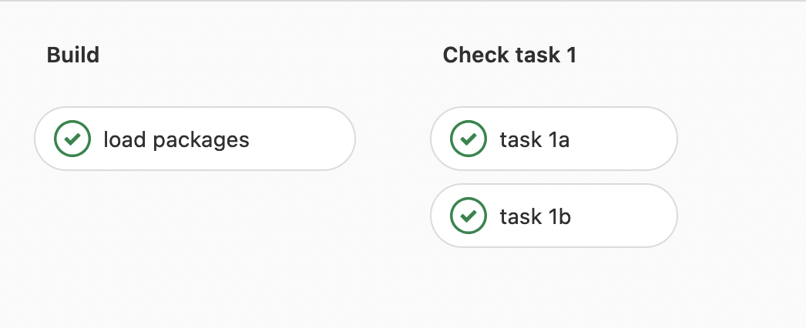

---
output:
  xaringan::moon_reader:
    lib_dir: libs
    css: ["./assets/xaringantheme-jlu.css"]  #Style sheet
    nature:
      beforeInit: "./assets/macros.js"  # individual macros
      seal: false  # no automatic title slide
      highlightStyle: github
      highlightLines: true
      highlightLanguage: ["r"]
      countIncrementalSlides: false  # incremental does not count as single slide 
      ratio: '16:9'  
      slideNumberFormat: |   # progress bar instead of slide numbers
        <div class="progress-bar-container">
          <div class="progress-bar" style="width: calc(%current% / %total% * 100%);">
          </div>
        </div>    
      navigation:
        scroll: false  #mouse scroll off (otherwise copying code is difficult)
---
```{r setup, include=FALSE}
library("knitr")  
library("rmarkdown")
library("tidyverse")
library("DT")  # Table illustration
library("icons")  # Social Media Links
library("RefManageR") # Zitation
library("xaringanBuilder") # Export
library("xaringanExtra") # some extras (panels, copyable code, etc.)

# Code Options
opts_chunk$set(fig.path = "assets/createdpics/", # path for calculated figures
               fig.align = "center",  # alignment of figure (also possible right, left, default)
               fig.show = "hold", # how to show figures: hold -> direct at the end of code chunk; animate: all plots in an animation
               out.width = "50%",
               echo = TRUE,     # Code is printed
               eval = FALSE,    # Code is NOT evaluated
               warning = FALSE, # warnings are NOT displayed
               message = FALSE, # messages are NOT displayed
               background = "#E7E7E7", # background color of code chunks
               comment = "", # no hashtags before output
               results = "markdown",
               rows.print = 15
)

# data table options
options(DT.options = list(pageLength = 5,
                          language = list(search = 'Filter:'),
                          autowidth = TRUE,
                          lengthChange = FALSE,
                          formatStyle = (fontSize = "40%"))
        )

# copyable code
htmltools::tagList(
  xaringanExtra::use_clipboard(
    button_text = "<i class=\"fa fa-clipboard\"></i>",
    success_text = "<i class=\"fa fa-check\" style=\"color: #90BE6D\"></i>",
    error_text = "<i class=\"fa fa-times-circle\" style=\"color: #F94144\"></i>"
  ),
  rmarkdown::html_dependency_font_awesome()
)

# Referenzen
BibOptions(
  check.entries = FALSE, 
  bib.style = "authoryear", 
  cite.style = "authoryear", 
  style = "markdown",
  hyperlink = FALSE, 
  dashed = FALSE
)

lit = ReadBib("./assets/lit.bib")

# Suche
xaringanExtra::use_search(
  show_icon = FALSE,
  auto_search = TRUE,
  position = "top-right"
  )

income <- rnorm(1000, mean = 3975, sd = 500)
df <- as.data.frame(cbind(income))
```

class: title, center, middle

# Statistik<sup>+</sup>: Einstieg in R leicht gemacht!

## Anwendungsorientierte Statistikvermittlung 

### Philipp Kleer | Institut für Politikwissenschaft | FB 03 | Sommersemester 2022

<!--- Social Media Links, müssen angepasst werden -->
.social[
[`r icons::icon_style(fontawesome("envelope"), scale = 1.5)`](mailto:philipp.kleer@sowi.uni-giessen.de)     [`r icons::icon_style(fontawesome("orcid"), scale = 1.5)`](https://orcid.org/0000-0003-1935-387X)     [`r icons::icon_style(fontawesome("gitlab"), scale = 1.5)`](https://gitlab.ub.uni-giessen.de/bpkleer)     [`r icons::icon_style(fontawesome("university"), scale = 1.5)`](https://www.uni-giessen.de/faculties/f03/departments/dps/staff/researchers/kleer?set_language=en)     [`r icons::icon_style(fontawesome("researchgate"), scale = 1.5)`](https://www.researchgate.net/profile/Benedikt_Kleer)
] 

---

# Starten wir!
.pull-left[
.center[

]
]

???
- an Bedürfnisse ausgerichtet

- Kenntnisstand stärker berücksichtigt

--

.pull-right[
Dieser Kurs führt grundsätzlich in das Programmieren und im Besonderen in das Programmieren von statistischen Berechnungen mit R ein. Der Kurs ist daher für alle Studierende zu empfehlen, die grundsätzlich Interesse an einer Programmiersprache haben und verschiedene Instrumente, die während Programmschritten eingesetzt werden, kennenlernen möchten. 

**Kenntnisse aus Statistik I und Statistik II** finden in diesem Kurs Anwendung. Inhalte aus Statistik II erfolgen erst gegen Ende des Semesters, so dass die Übung der Vorlesung nichts vorwegnimmt. 

Der Kurs wurde **neu konzipiert**, um Studierende **ohne breite Computer-/Programmierkenntnisse** das Erlernen von R zu ermöglichen.
]

???
Dies kann von Interesse sein, wenn Studierende nach dem Studium eine Beschäftigung im (IT-)Projektbereich anstreben. Der Kurs ist so aufgebaut, dass auch Personen ohne tiefe Computerkenntnisse an dem Kurs teilnehmen können. Einzige Voraussetzung ist das eigene Interesse eine Programmiersprache und mit dieser eben statistische Anwendungen zu lernen.

---

# Was auf Sie zu kommt!
.pull-left-70[
.pull-left[
.center[

]
- Programmiersprache

- GNU-Projekt, daher frei erweiterbar, kostenlos und durch die Community immer up-to-date (neuere Methoden etc.)
]

.pull-right[
.center[

]
- Software, in der wir R benutzen

- *Integrated Development Environment* (IDE)

- wir nutzen Cloud-Version (über Uni lizenziert): Zugriff einfach aus dem Browser heraus (keine Installation notwendig )

- in der Einzelanwenderlizenz kostenlos (also auch Installation am eigenen Rechner möglich)

]
]

--

.pull-right-30[
.center[
 
]

- sogenannte *Version Control*

- erleichtert die gemeinsame Arbeit (kollaborativ) an Programm-Code

- erspart eine Menge Zeit an Datei-Management/-Versand, so dass wir die Zeit wirklich fürs Programieren/Lernen nutzen können (bzw. auf Dozentensicht für's Lehren)
]
 
---

# Was bedeutet R lernen?
--

.pull-left[
Im Gegensatz zu anderen Statistikprogrammen gibt es keine Benutzeroberfläche mit der *Click&Play* möglich ist. Stattdessen muss eine Programmier**sprache** gelernt werden. 

Das heißt wie bei dem Erlernen jeder anderen Sprache auch: Die Lernkurve ist zu Beginn sehr steil.

Auch wenn es zu Beginn schwerer ist R zu erlernen, ist der Nutzen um ein Vielfaches höher, da weiterführende Methoden oder Schritte mit der erlernten Programmier**sprache** später leichter umzusetzen ist. 
]

--
.pull-right[
.center[

]
]
???
Betonung liegt hier auf Sprache

Das Lernen von R ist quasi eine Investition in die Zukunft. 

machine learning

---

# Was wir lernen?

Programmiersprache lernen heißt **Funktionen** lernen. Eine Funktion ist eine Anweisung, die in einer Sprache (*R*) den Computer etwas ausführen lässt. 

Zum Beispiel in der Anwendung von *Statistik I* könnten wir uns den **Mittelwert einer Variable** ausgeben lassen. Nehmen wir als Beispiel einen Datensatz, der das Brutto-Einkommen der Bevölkerung Deutschlands beinhaltet. Der Datensatz heißt `df` und die Variable `income`: 

--

```{r eval=FALSE, echo=TRUE}
mean(df$income)
```

???
d.h. wir sehen hier, dass die Funktionen oftmals englische Namen haben
--

Wenn wir die Funktion oben ausführen, erhalten wir das Ergebnis: Im Durchschnitt verdienen Personen 

```{r eval=TRUE, echo=FALSE}
mean(df$income)
```

---

# Aufbau der Übung
Ziel der Übung ist es die Anwendungszeit zu maximieren, um so das übliche *troubleshooting* beim Erlernen eines neuen Programms bzw. einer neuen Programmiersprache angenehmer zu gestalten. 

???
In den üblichen wöchentlichen Kursen stellt ein Dozent:in meist INhalt vor und dann findet in max. 45 oder nur 30 min eine quick & dirty anwendung statt, die aber oftmals mehr Probleme schafft als dass es Studierenden weiterhilft. 
--

Daher findet der Kurs im **blended-learning**-Format statt. 

In Präsenzzeit findet Anwendung statt und Studierende bereiten Inhalte vor bzw. nach (**Lernbücher**). In der Vor-/Nachbereitung wird mit kleineren Trainingsdatensätzen gearbeitet, in der Präsenzzeit arbeiten wir mit tatsächlich erhobenen sozialwissenschaftlichen Daten. 

???

d.h. in der Präsenzzeit werden wir praktische Anwendung fokussieren und eben die Probelem die dabei auftreten. 
--

Wie beim Erlernen jeder anderen Sprache auch, müssen *Vokabeln* und die *Grammatik* zuhause gelernt werden und in der Präsenzzeit üben wir das *Sprechen* (Programmieren). 

---

# Aufbau der Übung

```{tikz, aufbau1, fig.ext = 'png', cache=TRUE, eval=TRUE, echo=FALSE, out.width = "15%"}
\usetikzlibrary{positioning} 
\usetikzlibrary{calc}
\usetikzlibrary{decorations.pathreplacing}
\usetikzlibrary{shapes}
\usetikzlibrary{arrows.meta}
\tikzstyle{line} = [line width = 0.15cm, color = black!50, text = black, -{Triangle[scale = 0.6]}] % Global definitions for tikz}

\begin{tikzpicture}
	% Lehrblöcke
	% Lernblock 1  	
  	\node [rectangle, align = center, draw=black, color = black, minimum width = 25mm, minimum height = 35mm, text depth = 3.25 cm] (l1) at (-8, 5){\textbf{Lernblock 1 (3x1.5h)}};
  	 \node [rectangle, align = center, color = black, minimum width = 25mm, minimum height = 15mm, text depth = 0.75 cm] (l1a) at (-8, 5){14.04.2022};	
  	 \node [rectangle, align = center, color = black, minimum width = 25mm, minimum height = 15mm, text depth = 0.75 cm] (l1b) at (-8, 4.5){Start mit R \& git};	  	  
  	  \node [rectangle, align = center, color = black, minimum width = 25mm, minimum height = 15mm, text depth = 0.75 cm, text width = 35mm] (l2b) at (-8, 4){Objekte \& Rechnungen in R};	 
  	
  	% Lernblock 2
  	%  \node [rectangle, align = center, draw=black, color = black, minimum width = 25mm, minimum height = 35mm, text depth = 3.25 cm] (l2) at (2.5, 5){\textbf{Lernblock 2 (3x1.5h)}};
  	%  \node [rectangle, align = center, color = black, minimum width = 25mm, minimum height = 15mm, text depth = 0.75 cm] (l2a) at (2.5, 5){05.05.2022};	
  	%  \node [rectangle, align = center, color = black, minimum width = 25mm, minimum height = 15mm, text depth = 0.75 cm, text width = 35mm] (l2b) at (2.5, 4.5){Import von Daten \& deskr. Statistik};	  	  
  	%   \node [rectangle, align = center, color = black, minimum width = 25mm, minimum height = 15mm, text depth = 0.75 cm, text width = 35mm] (l2b) at (2.5, 3.5){Datenhandling mit tidyr};	 
  	
  	% Lernblock 3
  	% \node [rectangle, align = center, draw=black, color = black, minimum width = 25mm, minimum height = 35mm, text depth = 3.25 cm] (l3) at (12.5, 5){\textbf{Lernblock 3 (3x1.5h)}};
  	% \node [rectangle, align = center, color = black, minimum width = 25mm, minimum height = 15mm, text depth = 0.75 cm] (l3a) at (12.5, 5){02.06.2022};	
  	% \node [rectangle, align = center, color = black, minimum width = 25mm, minimum height = 15mm, text depth = 0.75 cm, text width = 35mm] (l3b) at (12.5, 4.5){Zusammenhangs-masse};	  	  
  	%  \node [rectangle, align = center, color = black, minimum width = 25mm, minimum height = 15mm, text depth = 0.75 cm, text width = 35mm] (l3b) at (12.5, 3.5){Mittelwertvergleiche};	   	
  	 
  	 % Lernblock 4
  	% \node [rectangle, align = center, draw=black, color = black, minimum width = 25mm, minimum height = 35mm, text depth = 3.25 cm] (l4) at (12.5, -3){\textbf{Lernblock 4 (3x1.5h)}};
  	% \node [rectangle, align = center, color = black, minimum width = 25mm, minimum height = 15mm, text depth = 0.75 cm] (l4a) at (12.5, -3){30.06.2022};	
  	% \node [rectangle, align = center, color = black, minimum width = 25mm, minimum height = 15mm, text depth = 0.75 cm, text width = 35mm] (l4b) at (12.5, -4){Lineare Regression};	  	  
	
	% Lernblock 5
  %	 \node [rectangle, align = center, draw=black, color = black, minimum width = 25mm, minimum height = 35mm, text depth = 3.25 cm] (l5) at (2.5, -3){\textbf{Lernblock 5 (3x1.5h)}};
  %	 \node [rectangle, align = center, color = black, minimum width = 25mm, minimum height = 15mm, text depth = 0.75 cm] (l5a) at (2.5, -3){14.07.2022};	
  %	 \node [rectangle, align = center, color = black, minimum width = 25mm, minimum height = 15mm, text depth = 0.75 cm, text width = 35mm] (l5b) at (2.5, -4){ggplot};	  	  
  	 
  	 % Lines
% 	\draw[->, line width=1.5mm, color = black] (l1) -- (l2);
	
%	\draw[->, line width=1.5mm, color = black] (l2) -- (l3);
	
%	\draw[->, line width=1.5mm, color = black] (l3) -- (l4);
	
%	\draw[->, line width=1.5mm, color = black] (l4) -- (l5);
	
  	% Zwischenarbeit
%  	\node [rectangle, align = left, color = black, minimum width = 25mm, minimum height = 15mm, text depth = 0.75 cm, text width = 30mm] (l12n) at (-4, 5.5){\small{Nachbereitung LB 1 bis 21.04.}};
%  	  	\node [rectangle, align = right, color = black, minimum width = 25mm, minimum height = 15mm, text depth = 0.75 cm, text width = 30mm] (l12v) at (-1.75, 4.25){\small{Vorbereitung LB 2 ab 22.04.}};
  	  	
  %	\node [rectangle, align = left, color = black, minimum width = 25mm, minimum height = 15mm, text depth = 0.75 cm, text width = 30mm] (l23n) at (6.5, 5.5){\small{Nachbereitung LB 2 bis 19.05.}};
  %	 \node [rectangle, align = right, color = black, minimum width = 25mm, minimum height = 15mm, text depth = 0.75 cm, text width = 30mm] (l23v) at (8.25, 4.25){\small{Vorbereitung LB 3 ab 19.05.}};
  	  	
  %	\node [rectangle, align = left, color = black, minimum width = 25mm, minimum height = 15mm, text depth = 0.75 cm, text width = 30mm] (l34n) at (14.25, 2.25){\small{Nachbereitung LB 3 bis 16.06.}};
 % 	 \node [rectangle, align = right, color = black, minimum width = 25mm, minimum height = 15mm, text depth = 0.75 cm, text width = 30mm] (l34v) at (10.75, -0.25){\small{Vorbereitung LB 4 ab 16.06.}};
  	  	
  %	 	\node [rectangle, align = right, color = black, minimum width = 25mm, minimum height = 15mm, text depth = 0.75 cm, text width = 30mm] (l34n) at (8.5, -4){\small{Nachbereitung LB 4 bis 30.07.}};
  %	  	\node [rectangle, align = left, color = black, minimum width = 25mm, minimum height = 15mm, text depth = 0.75 cm, text width = 30mm] (l34v) at (7, -2.5){\small{Vorbereitung LB 5 ab 07.07.}};
  	  	
	% Test cases
%	\node [rectangle, align = center, color = red, draw= red, minimum width = 25mm, minimum height = 15mm, text depth = 0.75 cm, text width = 20mm] (test1) at (-3, 2){\small{Test case LB 1}};
	
%	\draw[->, line width=1.5mm, color = red] (test1) -- (-3, 5);
	
%	\node [rectangle, align = center, color = red, draw= red, minimum width = 25mm, minimum height = 15mm, text depth = 0.75 cm, text width = 20mm] (test2) at (7, 2){\small{Test case LB 2}};
	
%	\draw[->, line width=1.5mm, color = red] (test2) -- (7, 5);

%	\node [rectangle, align = center, color = red, draw= red, minimum width = 25mm, minimum height = 15mm, text depth = 0.75 cm, text width = 20mm] (test3) at (15, 0){\small{Test case LB 3}};

%	\draw[->, line width=1.5mm, color = red] (test3) -- (12.5, 1.5);
		
%	\node [rectangle, align = center, color = red, draw= red, minimum width = 25mm, minimum height = 15mm, text depth = 0.75 cm, text width = 20mm] (test4) at (7, -6){\small{Test case LB 4}};
	
%	\draw[->, line width=1.5mm, color = red] (test4) -- (7, -3);	
		
  	  	
\end{tikzpicture}
```


---

# Aufbau der Übung

```{tikz, aufbau2, fig.ext = 'png', cache=TRUE, eval=TRUE, echo=FALSE, out.width = "55%"}
\usetikzlibrary{positioning} 
\usetikzlibrary{calc}
\usetikzlibrary{decorations.pathreplacing}
\usetikzlibrary{shapes}
\usetikzlibrary{arrows.meta}
\tikzstyle{line} = [line width = 0.15cm, color = black!50, text = black, -{Triangle[scale = 0.6]}] % Global definitions for tikz}

\begin{tikzpicture}
	% Lehrblöcke
	% Lernblock 1  	
  	\node [rectangle, align = center, draw=black, color = black, minimum width = 25mm, minimum height = 35mm, text depth = 3.25 cm] (l1) at (-8, 5){\textbf{Lernblock 1 (4h)}};
  	 \node [rectangle, align = center, color = black, minimum width = 25mm, minimum height = 15mm, text depth = 0.75 cm] (l1a) at (-8, 5){14.04.2022};	
  	 \node [rectangle, align = center, color = black, minimum width = 25mm, minimum height = 15mm, text depth = 0.75 cm] (l1b) at (-8, 4.5){Start mit R \& git};	  	  
  	  \node [rectangle, align = center, color = black, minimum width = 25mm, minimum height = 15mm, text depth = 0.75 cm, text width = 35mm] (l2b) at (-8, 4){Objekte \& Rechnungen in R};	 
  	
  	% Lernblock 2
  	  \node [rectangle, align = center, draw=black, color = black, minimum width = 25mm, minimum height = 35mm, text depth = 3.25 cm] (l2) at (2.5, 5){\textbf{Lernblock 2 (3x1.5h)}};
  	  \node [rectangle, align = center, color = black, minimum width = 25mm, minimum height = 15mm, text depth = 0.75 cm] (l2a) at (2.5, 5){05.05.2022};	
  	  \node [rectangle, align = center, color = black, minimum width = 25mm, minimum height = 15mm, text depth = 0.75 cm, text width = 35mm] (l2b) at (2.5, 4.5){Import von Daten \& deskr. Statistik};	  	  
  	   \node [rectangle, align = center, color = black, minimum width = 25mm, minimum height = 15mm, text depth = 0.75 cm, text width = 35mm] (l2b) at (2.5, 3.5){Datenhandling mit tidyr};	 
  	
  	% Lernblock 3
  	% \node [rectangle, align = center, draw=black, color = black, minimum width = 25mm, minimum height = 35mm, text depth = 3.25 cm] (l3) at (12.5, 5){\textbf{Lernblock 3 (3x1.5h)}};
  	% \node [rectangle, align = center, color = black, minimum width = 25mm, minimum height = 15mm, text depth = 0.75 cm] (l3a) at (12.5, 5){02.06.2022};	
  	% \node [rectangle, align = center, color = black, minimum width = 25mm, minimum height = 15mm, text depth = 0.75 cm, text width = 35mm] (l3b) at (12.5, 4.5){Zusammenhangs-masse};	  	  
  	%  \node [rectangle, align = center, color = black, minimum width = 25mm, minimum height = 15mm, text depth = 0.75 cm, text width = 35mm] (l3b) at (12.5, 3.5){Mittelwertvergleiche};	   	
  	 
  	 % Lernblock 4
  	% \node [rectangle, align = center, draw=black, color = black, minimum width = 25mm, minimum height = 35mm, text depth = 3.25 cm] (l4) at (12.5, -3){\textbf{Lernblock 4 (3x1.5h)}};
  	% \node [rectangle, align = center, color = black, minimum width = 25mm, minimum height = 15mm, text depth = 0.75 cm] (l4a) at (12.5, -3){30.06.2022};	
  	% \node [rectangle, align = center, color = black, minimum width = 25mm, minimum height = 15mm, text depth = 0.75 cm, text width = 35mm] (l4b) at (12.5, -4){Lineare Regression};	  	  
	
	% Lernblock 5
  %	 \node [rectangle, align = center, draw=black, color = black, minimum width = 25mm, minimum height = 35mm, text depth = 3.25 cm] (l5) at (2.5, -3){\textbf{Lernblock 5 (3x1.5h)}};
  %	 \node [rectangle, align = center, color = black, minimum width = 25mm, minimum height = 15mm, text depth = 0.75 cm] (l5a) at (2.5, -3){14.07.2022};	
  %	 \node [rectangle, align = center, color = black, minimum width = 25mm, minimum height = 15mm, text depth = 0.75 cm, text width = 35mm] (l5b) at (2.5, -4){ggplot};	  	  
  	 
  	 % Lines
 	\draw[->, line width=1.5mm, color = black] (l1) -- (l2);
	
%	\draw[->, line width=1.5mm, color = black] (l2) -- (l3);
	
%	\draw[->, line width=1.5mm, color = black] (l3) -- (l4);
	
%	\draw[->, line width=1.5mm, color = black] (l4) -- (l5);
	
  	% Zwischenarbeit
%  	\node [rectangle, align = left, color = black, minimum width = 25mm, minimum height = 15mm, text depth = 0.75 cm, text width = 30mm] (l12n) at (-4, 5.5){\small{Nachbereitung LB 1 bis 21.04.}};
%  	  	\node [rectangle, align = right, color = black, minimum width = 25mm, minimum height = 15mm, text depth = 0.75 cm, text width = 30mm] (l12v) at (-1.75, 4.25){\small{Vorbereitung LB 2 ab 22.04.}};
  	  	
  %	\node [rectangle, align = left, color = black, minimum width = 25mm, minimum height = 15mm, text depth = 0.75 cm, text width = 30mm] (l23n) at (6.5, 5.5){\small{Nachbereitung LB 2 bis 19.05.}};
  %	 \node [rectangle, align = right, color = black, minimum width = 25mm, minimum height = 15mm, text depth = 0.75 cm, text width = 30mm] (l23v) at (8.25, 4.25){\small{Vorbereitung LB 3 ab 19.05.}};
  	  	
  %	\node [rectangle, align = left, color = black, minimum width = 25mm, minimum height = 15mm, text depth = 0.75 cm, text width = 30mm] (l34n) at (14.25, 2.25){\small{Nachbereitung LB 3 bis 16.06.}};
 % 	 \node [rectangle, align = right, color = black, minimum width = 25mm, minimum height = 15mm, text depth = 0.75 cm, text width = 30mm] (l34v) at (10.75, -0.25){\small{Vorbereitung LB 4 ab 16.06.}};
  	  	
  %	 	\node [rectangle, align = right, color = black, minimum width = 25mm, minimum height = 15mm, text depth = 0.75 cm, text width = 30mm] (l34n) at (8.5, -4){\small{Nachbereitung LB 4 bis 30.07.}};
  %	  	\node [rectangle, align = left, color = black, minimum width = 25mm, minimum height = 15mm, text depth = 0.75 cm, text width = 30mm] (l34v) at (7, -2.5){\small{Vorbereitung LB 5 ab 07.07.}};
  	  	
	% Test cases
%	\node [rectangle, align = center, color = red, draw= red, minimum width = 25mm, minimum height = 15mm, text depth = 0.75 cm, text width = 20mm] (test1) at (-3, 2){\small{Test case LB 1}};
	
%	\draw[->, line width=1.5mm, color = red] (test1) -- (-3, 5);
	
%	\node [rectangle, align = center, color = red, draw= red, minimum width = 25mm, minimum height = 15mm, text depth = 0.75 cm, text width = 20mm] (test2) at (7, 2){\small{Test case LB 2}};
	
%	\draw[->, line width=1.5mm, color = red] (test2) -- (7, 5);

%	\node [rectangle, align = center, color = red, draw= red, minimum width = 25mm, minimum height = 15mm, text depth = 0.75 cm, text width = 20mm] (test3) at (15, 0){\small{Test case LB 3}};

%	\draw[->, line width=1.5mm, color = red] (test3) -- (12.5, 1.5);
		
%	\node [rectangle, align = center, color = red, draw= red, minimum width = 25mm, minimum height = 15mm, text depth = 0.75 cm, text width = 20mm] (test4) at (7, -6){\small{Test case LB 4}};
	
%	\draw[->, line width=1.5mm, color = red] (test4) -- (7, -3);	
		
  	  	
\end{tikzpicture}
```


---

# Aufbau der Übung

```{tikz, aufbau3, fig.ext = 'png', cache=TRUE, eval=TRUE, echo=FALSE, out.width = "85%"}
\usetikzlibrary{positioning} 
\usetikzlibrary{calc}
\usetikzlibrary{decorations.pathreplacing}
\usetikzlibrary{shapes}
\usetikzlibrary{arrows.meta}
\tikzstyle{line} = [line width = 0.15cm, color = black!50, text = black, -{Triangle[scale = 0.6]}] % Global definitions for tikz}

\begin{tikzpicture}
	% Lehrblöcke
	% Lernblock 1  	
  	\node [rectangle, align = center, draw=black, color = black, minimum width = 25mm, minimum height = 35mm, text depth = 3.25 cm] (l1) at (-8, 5){\textbf{Lernblock 1 (4h)}};
  	 \node [rectangle, align = center, color = black, minimum width = 25mm, minimum height = 15mm, text depth = 0.75 cm] (l1a) at (-8, 5){14.04.2022};	
  	 \node [rectangle, align = center, color = black, minimum width = 25mm, minimum height = 15mm, text depth = 0.75 cm] (l1b) at (-8, 4.5){Start mit R \& git};	  	  
  	  \node [rectangle, align = center, color = black, minimum width = 25mm, minimum height = 15mm, text depth = 0.75 cm, text width = 35mm] (l2b) at (-8, 4){Objekte \& Rechnungen in R};	 
  	
  	% Lernblock 2
  	  \node [rectangle, align = center, draw=black, color = black, minimum width = 25mm, minimum height = 35mm, text depth = 3.25 cm] (l2) at (2.5, 5){\textbf{Lernblock 2 (3x1.5h)}};
  	  \node [rectangle, align = center, color = black, minimum width = 25mm, minimum height = 15mm, text depth = 0.75 cm] (l2a) at (2.5, 5){05.05.2022};	
  	  \node [rectangle, align = center, color = black, minimum width = 25mm, minimum height = 15mm, text depth = 0.75 cm, text width = 35mm] (l2b) at (2.5, 4.5){Import von Daten \& deskr. Statistik};	  	  
  	   \node [rectangle, align = center, color = black, minimum width = 25mm, minimum height = 15mm, text depth = 0.75 cm, text width = 35mm] (l2b) at (2.5, 3.5){Datenhandling mit tidyr};	 
  	
  	% Lernblock 3
  	 \node [rectangle, align = center, draw=black, color = black, minimum width = 25mm, minimum height = 35mm, text depth = 3.25 cm] (l3) at (12.5, 5){\textbf{Lernblock 3 (3x1.5h)}};
  	 \node [rectangle, align = center, color = black, minimum width = 25mm, minimum height = 15mm, text depth = 0.75 cm] (l3a) at (12.5, 5){02.06.2022};	
  	 \node [rectangle, align = center, color = black, minimum width = 25mm, minimum height = 15mm, text depth = 0.75 cm, text width = 35mm] (l3b) at (12.5, 4.5){Zusammenhangs-masse};	  	  
  	  \node [rectangle, align = center, color = black, minimum width = 25mm, minimum height = 15mm, text depth = 0.75 cm, text width = 35mm] (l3b) at (12.5, 3.5){Mittelwertvergleiche};	   	
  	 
  	 % Lernblock 4
  	% \node [rectangle, align = center, draw=black, color = black, minimum width = 25mm, minimum height = 35mm, text depth = 3.25 cm] (l4) at (12.5, -3){\textbf{Lernblock 4 (3x1.5h)}};
  	% \node [rectangle, align = center, color = black, minimum width = 25mm, minimum height = 15mm, text depth = 0.75 cm] (l4a) at (12.5, -3){30.06.2022};	
  	% \node [rectangle, align = center, color = black, minimum width = 25mm, minimum height = 15mm, text depth = 0.75 cm, text width = 35mm] (l4b) at (12.5, -4){Lineare Regression};	  	  
	
	% Lernblock 5
  %	 \node [rectangle, align = center, draw=black, color = black, minimum width = 25mm, minimum height = 35mm, text depth = 3.25 cm] (l5) at (2.5, -3){\textbf{Lernblock 5 (3x1.5h)}};
  %	 \node [rectangle, align = center, color = black, minimum width = 25mm, minimum height = 15mm, text depth = 0.75 cm] (l5a) at (2.5, -3){14.07.2022};	
  %	 \node [rectangle, align = center, color = black, minimum width = 25mm, minimum height = 15mm, text depth = 0.75 cm, text width = 35mm] (l5b) at (2.5, -4){ggplot};	  	  
  	 
  	 % Lines
 	\draw[->, line width=1.5mm, color = black] (l1) -- (l2);
	
	\draw[->, line width=1.5mm, color = black] (l2) -- (l3);
	
%	\draw[->, line width=1.5mm, color = black] (l3) -- (l4);
	
%	\draw[->, line width=1.5mm, color = black] (l4) -- (l5);
	
  	% Zwischenarbeit
%  	\node [rectangle, align = left, color = black, minimum width = 25mm, minimum height = 15mm, text depth = 0.75 cm, text width = 30mm] (l12n) at (-4, 5.5){\small{Nachbereitung LB 1 bis 21.04.}};
%  	  	\node [rectangle, align = right, color = black, minimum width = 25mm, minimum height = 15mm, text depth = 0.75 cm, text width = 30mm] (l12v) at (-1.75, 4.25){\small{Vorbereitung LB 2 ab 22.04.}};
  	  	
  %	\node [rectangle, align = left, color = black, minimum width = 25mm, minimum height = 15mm, text depth = 0.75 cm, text width = 30mm] (l23n) at (6.5, 5.5){\small{Nachbereitung LB 2 bis 19.05.}};
  %	 \node [rectangle, align = right, color = black, minimum width = 25mm, minimum height = 15mm, text depth = 0.75 cm, text width = 30mm] (l23v) at (8.25, 4.25){\small{Vorbereitung LB 3 ab 19.05.}};
  	  	
  %	\node [rectangle, align = left, color = black, minimum width = 25mm, minimum height = 15mm, text depth = 0.75 cm, text width = 30mm] (l34n) at (14.25, 2.25){\small{Nachbereitung LB 3 bis 16.06.}};
 % 	 \node [rectangle, align = right, color = black, minimum width = 25mm, minimum height = 15mm, text depth = 0.75 cm, text width = 30mm] (l34v) at (10.75, -0.25){\small{Vorbereitung LB 4 ab 16.06.}};
  	  	
  %	 	\node [rectangle, align = right, color = black, minimum width = 25mm, minimum height = 15mm, text depth = 0.75 cm, text width = 30mm] (l34n) at (8.5, -4){\small{Nachbereitung LB 4 bis 30.07.}};
  %	  	\node [rectangle, align = left, color = black, minimum width = 25mm, minimum height = 15mm, text depth = 0.75 cm, text width = 30mm] (l34v) at (7, -2.5){\small{Vorbereitung LB 5 ab 07.07.}};
  	  	
	% Test cases
%	\node [rectangle, align = center, color = red, draw= red, minimum width = 25mm, minimum height = 15mm, text depth = 0.75 cm, text width = 20mm] (test1) at (-3, 2){\small{Test case LB 1}};
	
%	\draw[->, line width=1.5mm, color = red] (test1) -- (-3, 5);
	
%	\node [rectangle, align = center, color = red, draw= red, minimum width = 25mm, minimum height = 15mm, text depth = 0.75 cm, text width = 20mm] (test2) at (7, 2){\small{Test case LB 2}};
	
%	\draw[->, line width=1.5mm, color = red] (test2) -- (7, 5);

%	\node [rectangle, align = center, color = red, draw= red, minimum width = 25mm, minimum height = 15mm, text depth = 0.75 cm, text width = 20mm] (test3) at (15, 0){\small{Test case LB 3}};

%	\draw[->, line width=1.5mm, color = red] (test3) -- (12.5, 1.5);
		
%	\node [rectangle, align = center, color = red, draw= red, minimum width = 25mm, minimum height = 15mm, text depth = 0.75 cm, text width = 20mm] (test4) at (7, -6){\small{Test case LB 4}};
	
%	\draw[->, line width=1.5mm, color = red] (test4) -- (7, -3);	
		
  	  	
\end{tikzpicture}
```


---
# Aufbau der Übung

```{tikz, aufbau4, fig.ext = 'png', cache=TRUE, eval=TRUE, echo=FALSE, out.width = "85%"}
\usetikzlibrary{positioning} 
\usetikzlibrary{calc}
\usetikzlibrary{decorations.pathreplacing}
\usetikzlibrary{shapes}
\usetikzlibrary{arrows.meta}
\tikzstyle{line} = [line width = 0.15cm, color = black!50, text = black, -{Triangle[scale = 0.6]}] % Global definitions for tikz}

\begin{tikzpicture}
	% Lehrblöcke
	% Lernblock 1  	
  	\node [rectangle, align = center, draw=black, color = black, minimum width = 25mm, minimum height = 35mm, text depth = 3.25 cm] (l1) at (-8, 5){\textbf{Lernblock 1 (4h)}};
  	 \node [rectangle, align = center, color = black, minimum width = 25mm, minimum height = 15mm, text depth = 0.75 cm] (l1a) at (-8, 5){14.04.2022};	
  	 \node [rectangle, align = center, color = black, minimum width = 25mm, minimum height = 15mm, text depth = 0.75 cm] (l1b) at (-8, 4.5){Start mit R \& git};	  	  
  	  \node [rectangle, align = center, color = black, minimum width = 25mm, minimum height = 15mm, text depth = 0.75 cm, text width = 35mm] (l2b) at (-8, 4){Objekte \& Rechnungen in R};	 
  	
  	% Lernblock 2
  	  \node [rectangle, align = center, draw=black, color = black, minimum width = 25mm, minimum height = 35mm, text depth = 3.25 cm] (l2) at (2.5, 5){\textbf{Lernblock 2 (3x1.5h)}};
  	  \node [rectangle, align = center, color = black, minimum width = 25mm, minimum height = 15mm, text depth = 0.75 cm] (l2a) at (2.5, 5){05.05.2022};	
  	  \node [rectangle, align = center, color = black, minimum width = 25mm, minimum height = 15mm, text depth = 0.75 cm, text width = 35mm] (l2b) at (2.5, 4.5){Import von Daten \& deskr. Statistik};	  	  
  	   \node [rectangle, align = center, color = black, minimum width = 25mm, minimum height = 15mm, text depth = 0.75 cm, text width = 35mm] (l2b) at (2.5, 3.5){Datenhandling mit tidyr};	 
  	
  	% Lernblock 3
  	 \node [rectangle, align = center, draw=black, color = black, minimum width = 25mm, minimum height = 35mm, text depth = 3.25 cm] (l3) at (12.5, 5){\textbf{Lernblock 3 (3x1.5h)}};
  	 \node [rectangle, align = center, color = black, minimum width = 25mm, minimum height = 15mm, text depth = 0.75 cm] (l3a) at (12.5, 5){02.06.2022};	
  	 \node [rectangle, align = center, color = black, minimum width = 25mm, minimum height = 15mm, text depth = 0.75 cm, text width = 35mm] (l3b) at (12.5, 4.5){Zusammenhangs-masse};	  	  
  	  \node [rectangle, align = center, color = black, minimum width = 25mm, minimum height = 15mm, text depth = 0.75 cm, text width = 35mm] (l3b) at (12.5, 3.5){Mittelwertvergleiche};	   	
  	 
  	 % Lernblock 4
  	 \node [rectangle, align = center, draw=black, color = black, minimum width = 25mm, minimum height = 35mm, text depth = 3.25 cm] (l4) at (12.5, -3){\textbf{Lernblock 4 (3x1.5h)}};
  	 \node [rectangle, align = center, color = black, minimum width = 25mm, minimum height = 15mm, text depth = 0.75 cm] (l4a) at (12.5, -3){30.06.2022};	
  	 \node [rectangle, align = center, color = black, minimum width = 25mm, minimum height = 15mm, text depth = 0.75 cm, text width = 35mm] (l4b) at (12.5, -4){Lineare Regression};	  	  
	
	% Lernblock 5
  %	 \node [rectangle, align = center, draw=black, color = black, minimum width = 25mm, minimum height = 35mm, text depth = 3.25 cm] (l5) at (2.5, -3){\textbf{Lernblock 5 (3x1.5h)}};
  %	 \node [rectangle, align = center, color = black, minimum width = 25mm, minimum height = 15mm, text depth = 0.75 cm] (l5a) at (2.5, -3){14.07.2022};	
  %	 \node [rectangle, align = center, color = black, minimum width = 25mm, minimum height = 15mm, text depth = 0.75 cm, text width = 35mm] (l5b) at (2.5, -4){ggplot};	  	  
  	 
  	 % Lines
 	\draw[->, line width=1.5mm, color = black] (l1) -- (l2);
	
	\draw[->, line width=1.5mm, color = black] (l2) -- (l3);
	
	\draw[->, line width=1.5mm, color = black] (l3) -- (l4);
	
%	\draw[->, line width=1.5mm, color = black] (l4) -- (l5);
	
  	% Zwischenarbeit
%  	\node [rectangle, align = left, color = black, minimum width = 25mm, minimum height = 15mm, text depth = 0.75 cm, text width = 30mm] (l12n) at (-4, 5.5){\small{Nachbereitung LB 1 bis 21.04.}};
%  	  	\node [rectangle, align = right, color = black, minimum width = 25mm, minimum height = 15mm, text depth = 0.75 cm, text width = 30mm] (l12v) at (-1.75, 4.25){\small{Vorbereitung LB 2 ab 22.04.}};
  	  	
  %	\node [rectangle, align = left, color = black, minimum width = 25mm, minimum height = 15mm, text depth = 0.75 cm, text width = 30mm] (l23n) at (6.5, 5.5){\small{Nachbereitung LB 2 bis 19.05.}};
  %	 \node [rectangle, align = right, color = black, minimum width = 25mm, minimum height = 15mm, text depth = 0.75 cm, text width = 30mm] (l23v) at (8.25, 4.25){\small{Vorbereitung LB 3 ab 19.05.}};
  	  	
  %	\node [rectangle, align = left, color = black, minimum width = 25mm, minimum height = 15mm, text depth = 0.75 cm, text width = 30mm] (l34n) at (14.25, 2.25){\small{Nachbereitung LB 3 bis 16.06.}};
 % 	 \node [rectangle, align = right, color = black, minimum width = 25mm, minimum height = 15mm, text depth = 0.75 cm, text width = 30mm] (l34v) at (10.75, -0.25){\small{Vorbereitung LB 4 ab 16.06.}};
  	  	
  %	 	\node [rectangle, align = right, color = black, minimum width = 25mm, minimum height = 15mm, text depth = 0.75 cm, text width = 30mm] (l34n) at (8.5, -4){\small{Nachbereitung LB 4 bis 30.07.}};
  %	  	\node [rectangle, align = left, color = black, minimum width = 25mm, minimum height = 15mm, text depth = 0.75 cm, text width = 30mm] (l34v) at (7, -2.5){\small{Vorbereitung LB 5 ab 07.07.}};
  	  	
	% Test cases
%	\node [rectangle, align = center, color = red, draw= red, minimum width = 25mm, minimum height = 15mm, text depth = 0.75 cm, text width = 20mm] (test1) at (-3, 2){\small{Test case LB 1}};
	
%	\draw[->, line width=1.5mm, color = red] (test1) -- (-3, 5);
	
%	\node [rectangle, align = center, color = red, draw= red, minimum width = 25mm, minimum height = 15mm, text depth = 0.75 cm, text width = 20mm] (test2) at (7, 2){\small{Test case LB 2}};
	
%	\draw[->, line width=1.5mm, color = red] (test2) -- (7, 5);

%	\node [rectangle, align = center, color = red, draw= red, minimum width = 25mm, minimum height = 15mm, text depth = 0.75 cm, text width = 20mm] (test3) at (15, 0){\small{Test case LB 3}};

%	\draw[->, line width=1.5mm, color = red] (test3) -- (12.5, 1.5);
		
%	\node [rectangle, align = center, color = red, draw= red, minimum width = 25mm, minimum height = 15mm, text depth = 0.75 cm, text width = 20mm] (test4) at (7, -6){\small{Test case LB 4}};
	
%	\draw[->, line width=1.5mm, color = red] (test4) -- (7, -3);	
		
  	  	
\end{tikzpicture}
```


---
# Aufbau der Übung

```{tikz, aufbau5, fig.ext = 'png', cache=TRUE, eval=TRUE, echo=FALSE, out.width = "85%"}
\usetikzlibrary{positioning} 
\usetikzlibrary{calc}
\usetikzlibrary{decorations.pathreplacing}
\usetikzlibrary{shapes}
\usetikzlibrary{arrows.meta}
\tikzstyle{line} = [line width = 0.15cm, color = black!50, text = black, -{Triangle[scale = 0.6]}] % Global definitions for tikz}

\begin{tikzpicture}
	% Lehrblöcke
	% Lernblock 1  	
  	\node [rectangle, align = center, draw=black, color = black, minimum width = 25mm, minimum height = 35mm, text depth = 3.25 cm] (l1) at (-8, 5){\textbf{Lernblock 1 (4h)}};
  	 \node [rectangle, align = center, color = black, minimum width = 25mm, minimum height = 15mm, text depth = 0.75 cm] (l1a) at (-8, 5){14.04.2022};	
  	 \node [rectangle, align = center, color = black, minimum width = 25mm, minimum height = 15mm, text depth = 0.75 cm] (l1b) at (-8, 4.5){Start mit R \& git};	  	  
  	  \node [rectangle, align = center, color = black, minimum width = 25mm, minimum height = 15mm, text depth = 0.75 cm, text width = 35mm] (l2b) at (-8, 4){Objekte \& Rechnungen in R};	 
  	
  	% Lernblock 2
  	  \node [rectangle, align = center, draw=black, color = black, minimum width = 25mm, minimum height = 35mm, text depth = 3.25 cm] (l2) at (2.5, 5){\textbf{Lernblock 2 (3x1.5h)}};
  	  \node [rectangle, align = center, color = black, minimum width = 25mm, minimum height = 15mm, text depth = 0.75 cm] (l2a) at (2.5, 5){05.05.2022};	
  	  \node [rectangle, align = center, color = black, minimum width = 25mm, minimum height = 15mm, text depth = 0.75 cm, text width = 35mm] (l2b) at (2.5, 4.5){Import von Daten \& deskr. Statistik};	  	  
  	   \node [rectangle, align = center, color = black, minimum width = 25mm, minimum height = 15mm, text depth = 0.75 cm, text width = 35mm] (l2b) at (2.5, 3.5){Datenhandling mit tidyr};	 
  	
  	% Lernblock 3
  	 \node [rectangle, align = center, draw=black, color = black, minimum width = 25mm, minimum height = 35mm, text depth = 3.25 cm] (l3) at (12.5, 5){\textbf{Lernblock 3 (3x1.5h)}};
  	 \node [rectangle, align = center, color = black, minimum width = 25mm, minimum height = 15mm, text depth = 0.75 cm] (l3a) at (12.5, 5){02.06.2022};	
  	 \node [rectangle, align = center, color = black, minimum width = 25mm, minimum height = 15mm, text depth = 0.75 cm, text width = 35mm] (l3b) at (12.5, 4.5){Zusammenhangs-masse};	  	  
  	  \node [rectangle, align = center, color = black, minimum width = 25mm, minimum height = 15mm, text depth = 0.75 cm, text width = 35mm] (l3b) at (12.5, 3.5){Mittelwertvergleiche};	   	
  	 
  	 % Lernblock 4
  	 \node [rectangle, align = center, draw=black, color = black, minimum width = 25mm, minimum height = 35mm, text depth = 3.25 cm] (l4) at (12.5, -3){\textbf{Lernblock 4 (3x1.5h)}};
  	 \node [rectangle, align = center, color = black, minimum width = 25mm, minimum height = 15mm, text depth = 0.75 cm] (l4a) at (12.5, -3){30.06.2022};	
  	 \node [rectangle, align = center, color = black, minimum width = 25mm, minimum height = 15mm, text depth = 0.75 cm, text width = 35mm] (l4b) at (12.5, -4){Lineare Regression};	  	  
	
	% Lernblock 5
  	 \node [rectangle, align = center, draw=black, color = black, minimum width = 25mm, minimum height = 35mm, text depth = 3.25 cm] (l5) at (2.5, -3){\textbf{Lernblock 5 (3x1.5h)}};
  	 \node [rectangle, align = center, color = black, minimum width = 25mm, minimum height = 15mm, text depth = 0.75 cm] (l5a) at (2.5, -3){14.07.2022};	
  	 \node [rectangle, align = center, color = black, minimum width = 25mm, minimum height = 15mm, text depth = 0.75 cm, text width = 35mm] (l5b) at (2.5, -4){ggplot};	  	  
  	 
  	 % Lines
 	\draw[->, line width=1.5mm, color = black] (l1) -- (l2);
	
	\draw[->, line width=1.5mm, color = black] (l2) -- (l3);
	
	\draw[->, line width=1.5mm, color = black] (l3) -- (l4);
	
	\draw[->, line width=1.5mm, color = black] (l4) -- (l5);
	
  	% Zwischenarbeit
%  	\node [rectangle, align = left, color = black, minimum width = 25mm, minimum height = 15mm, text depth = 0.75 cm, text width = 30mm] (l12n) at (-4, 5.5){\small{Nachbereitung LB 1 bis 21.04.}};
%  	  	\node [rectangle, align = right, color = black, minimum width = 25mm, minimum height = 15mm, text depth = 0.75 cm, text width = 30mm] (l12v) at (-1.75, 4.25){\small{Vorbereitung LB 2 ab 22.04.}};
  	  	
  %	\node [rectangle, align = left, color = black, minimum width = 25mm, minimum height = 15mm, text depth = 0.75 cm, text width = 30mm] (l23n) at (6.5, 5.5){\small{Nachbereitung LB 2 bis 19.05.}};
  %	 \node [rectangle, align = right, color = black, minimum width = 25mm, minimum height = 15mm, text depth = 0.75 cm, text width = 30mm] (l23v) at (8.25, 4.25){\small{Vorbereitung LB 3 ab 19.05.}};
  	  	
  %	\node [rectangle, align = left, color = black, minimum width = 25mm, minimum height = 15mm, text depth = 0.75 cm, text width = 30mm] (l34n) at (14.25, 2.25){\small{Nachbereitung LB 3 bis 16.06.}};
 % 	 \node [rectangle, align = right, color = black, minimum width = 25mm, minimum height = 15mm, text depth = 0.75 cm, text width = 30mm] (l34v) at (10.75, -0.25){\small{Vorbereitung LB 4 ab 16.06.}};
  	  	
  %	 	\node [rectangle, align = right, color = black, minimum width = 25mm, minimum height = 15mm, text depth = 0.75 cm, text width = 30mm] (l34n) at (8.5, -4){\small{Nachbereitung LB 4 bis 30.07.}};
  %	  	\node [rectangle, align = left, color = black, minimum width = 25mm, minimum height = 15mm, text depth = 0.75 cm, text width = 30mm] (l34v) at (7, -2.5){\small{Vorbereitung LB 5 ab 07.07.}};
  	  	
	% Test cases
%	\node [rectangle, align = center, color = red, draw= red, minimum width = 25mm, minimum height = 15mm, text depth = 0.75 cm, text width = 20mm] (test1) at (-3, 2){\small{Test case LB 1}};
	
%	\draw[->, line width=1.5mm, color = red] (test1) -- (-3, 5);
	
%	\node [rectangle, align = center, color = red, draw= red, minimum width = 25mm, minimum height = 15mm, text depth = 0.75 cm, text width = 20mm] (test2) at (7, 2){\small{Test case LB 2}};
	
%	\draw[->, line width=1.5mm, color = red] (test2) -- (7, 5);

%	\node [rectangle, align = center, color = red, draw= red, minimum width = 25mm, minimum height = 15mm, text depth = 0.75 cm, text width = 20mm] (test3) at (15, 0){\small{Test case LB 3}};

%	\draw[->, line width=1.5mm, color = red] (test3) -- (12.5, 1.5);
		
%	\node [rectangle, align = center, color = red, draw= red, minimum width = 25mm, minimum height = 15mm, text depth = 0.75 cm, text width = 20mm] (test4) at (7, -6){\small{Test case LB 4}};
	
%	\draw[->, line width=1.5mm, color = red] (test4) -- (7, -3);	
		
  	  	
\end{tikzpicture}
```


---
# Blended-Learning (Vor-/Nachbereitung)

```{tikz, aufbau6, fig.ext = 'png', cache=TRUE, eval=TRUE, echo=FALSE, out.width = "85%"}
\usetikzlibrary{positioning} 
\usetikzlibrary{calc}
\usetikzlibrary{decorations.pathreplacing}
\usetikzlibrary{shapes}
\usetikzlibrary{arrows.meta}
\tikzstyle{line} = [line width = 0.15cm, color = black!50, text = black, -{Triangle[scale = 0.6]}] % Global definitions for tikz}

\begin{tikzpicture}
	% Lehrblöcke
	% Lernblock 1  	
  	\node [rectangle, align = center, draw=black, color = black, minimum width = 25mm, minimum height = 35mm, text depth = 3.25 cm] (l1) at (-8, 5){\textbf{Lernblock 1 (4h)}};
  	 \node [rectangle, align = center, color = black, minimum width = 25mm, minimum height = 15mm, text depth = 0.75 cm] (l1a) at (-8, 5){14.04.2022};	
  	 \node [rectangle, align = center, color = black, minimum width = 25mm, minimum height = 15mm, text depth = 0.75 cm] (l1b) at (-8, 4.5){Start mit R \& git};	  	  
  	  \node [rectangle, align = center, color = black, minimum width = 25mm, minimum height = 15mm, text depth = 0.75 cm, text width = 35mm] (l2b) at (-8, 4){Objekte \& Rechnungen in R};	 
  	
  	% Lernblock 2
  	  \node [rectangle, align = center, draw=black, color = black, minimum width = 25mm, minimum height = 35mm, text depth = 3.25 cm] (l2) at (2.5, 5){\textbf{Lernblock 2 (3x1.5h)}};
  	  \node [rectangle, align = center, color = black, minimum width = 25mm, minimum height = 15mm, text depth = 0.75 cm] (l2a) at (2.5, 5){05.05.2022};	
  	  \node [rectangle, align = center, color = black, minimum width = 25mm, minimum height = 15mm, text depth = 0.75 cm, text width = 35mm] (l2b) at (2.5, 4.5){Import von Daten \& deskr. Statistik};	  	  
  	   \node [rectangle, align = center, color = black, minimum width = 25mm, minimum height = 15mm, text depth = 0.75 cm, text width = 35mm] (l2b) at (2.5, 3.5){Datenhandling mit tidyr};	 
  	
  	% Lernblock 3
  	 \node [rectangle, align = center, draw=black, color = black, minimum width = 25mm, minimum height = 35mm, text depth = 3.25 cm] (l3) at (12.5, 5){\textbf{Lernblock 3 (3x1.5h)}};
  	 \node [rectangle, align = center, color = black, minimum width = 25mm, minimum height = 15mm, text depth = 0.75 cm] (l3a) at (12.5, 5){02.06.2022};	
  	 \node [rectangle, align = center, color = black, minimum width = 25mm, minimum height = 15mm, text depth = 0.75 cm, text width = 35mm] (l3b) at (12.5, 4.5){Zusammenhangs-masse};	  	  
  	  \node [rectangle, align = center, color = black, minimum width = 25mm, minimum height = 15mm, text depth = 0.75 cm, text width = 35mm] (l3b) at (12.5, 3.5){Mittelwertvergleiche};	   	
  	 
  	 % Lernblock 4
  	 \node [rectangle, align = center, draw=black, color = black, minimum width = 25mm, minimum height = 35mm, text depth = 3.25 cm] (l4) at (12.5, -3){\textbf{Lernblock 4 (3x1.5h)}};
  	 \node [rectangle, align = center, color = black, minimum width = 25mm, minimum height = 15mm, text depth = 0.75 cm] (l4a) at (12.5, -3){30.06.2022};	
  	 \node [rectangle, align = center, color = black, minimum width = 25mm, minimum height = 15mm, text depth = 0.75 cm, text width = 35mm] (l4b) at (12.5, -4){Lineare Regression};	  	  
	
	% Lernblock 5
  	 \node [rectangle, align = center, draw=black, color = black, minimum width = 25mm, minimum height = 35mm, text depth = 3.25 cm] (l5) at (2.5, -3){\textbf{Lernblock 5 (3x1.5h)}};
  	 \node [rectangle, align = center, color = black, minimum width = 25mm, minimum height = 15mm, text depth = 0.75 cm] (l5a) at (2.5, -3){14.07.2022};	
  	 \node [rectangle, align = center, color = black, minimum width = 25mm, minimum height = 15mm, text depth = 0.75 cm, text width = 35mm] (l5b) at (2.5, -4){ggplot};	  	  
  	 
  	 % Lines
 	\draw[->, line width=1.5mm, color = black] (l1) -- (l2);
	
	\draw[->, line width=1.5mm, color = black] (l2) -- (l3);
	
	\draw[->, line width=1.5mm, color = black] (l3) -- (l4);
	
	\draw[->, line width=1.5mm, color = black] (l4) -- (l5);
	
  	% Zwischenarbeit
  	\node [rectangle, align = left, color = black, minimum width = 25mm, minimum height = 15mm, text depth = 0.75 cm, text width = 30mm] (l12n) at (-4, 5.5){\small{Nachbereitung LB 1 bis 21.04.}};
  	  	\node [rectangle, align = right, color = black, minimum width = 25mm, minimum height = 15mm, text depth = 0.75 cm, text width = 30mm] (l12v) at (-1.75, 4.25){\small{Vorbereitung LB 2 ab 22.04.}};
  	  	
  	\node [rectangle, align = left, color = black, minimum width = 25mm, minimum height = 15mm, text depth = 0.75 cm, text width = 30mm] (l23n) at (6.5, 5.5){\small{Nachbereitung LB 2 bis 19.05.}};
  	 \node [rectangle, align = right, color = black, minimum width = 25mm, minimum height = 15mm, text depth = 0.75 cm, text width = 30mm] (l23v) at (8.25, 4.25){\small{Vorbereitung LB 3 ab 19.05.}};
  	  	
  	\node [rectangle, align = left, color = black, minimum width = 25mm, minimum height = 15mm, text depth = 0.75 cm, text width = 30mm] (l34n) at (14.25, 2.25){\small{Nachbereitung LB 3 bis 16.06.}};
  	 \node [rectangle, align = right, color = black, minimum width = 25mm, minimum height = 15mm, text depth = 0.75 cm, text width = 30mm] (l34v) at (10.75, -0.25){\small{Vorbereitung LB 4 ab 16.06.}};
  	  	
  	 	\node [rectangle, align = right, color = black, minimum width = 25mm, minimum height = 15mm, text depth = 0.75 cm, text width = 30mm] (l34n) at (8.5, -4){\small{Nachbereitung LB 4 bis 30.07.}};
  	  	\node [rectangle, align = left, color = black, minimum width = 25mm, minimum height = 15mm, text depth = 0.75 cm, text width = 30mm] (l34v) at (7, -2.5){\small{Vorbereitung LB 5 ab 07.07.}};
  	  	
	% Test cases
%	\node [rectangle, align = center, color = red, draw= red, minimum width = 25mm, minimum height = 15mm, text depth = 0.75 cm, text width = 20mm] (test1) at (-3, 2){\small{Test case LB 1}};
	
%	\draw[->, line width=1.5mm, color = red] (test1) -- (-3, 5);
	
%	\node [rectangle, align = center, color = red, draw= red, minimum width = 25mm, minimum height = 15mm, text depth = 0.75 cm, text width = 20mm] (test2) at (7, 2){\small{Test case LB 2}};
	
%	\draw[->, line width=1.5mm, color = red] (test2) -- (7, 5);

%	\node [rectangle, align = center, color = red, draw= red, minimum width = 25mm, minimum height = 15mm, text depth = 0.75 cm, text width = 20mm] (test3) at (15, 0){\small{Test case LB 3}};

%	\draw[->, line width=1.5mm, color = red] (test3) -- (12.5, 1.5);
		
%	\node [rectangle, align = center, color = red, draw= red, minimum width = 25mm, minimum height = 15mm, text depth = 0.75 cm, text width = 20mm] (test4) at (7, -6){\small{Test case LB 4}};
	
%	\draw[->, line width=1.5mm, color = red] (test4) -- (7, -3);	
		
  	  	
\end{tikzpicture}
```


---
# Semesterleistung

```{tikz, aufbau7, fig.ext = 'png', cache=TRUE, eval=TRUE, echo=FALSE, out.width = "85%"}
\usetikzlibrary{positioning} 
\usetikzlibrary{calc}
\usetikzlibrary{decorations.pathreplacing}
\usetikzlibrary{shapes}
\usetikzlibrary{arrows.meta}
\tikzstyle{line} = [line width = 0.15cm, color = black!50, text = black, -{Triangle[scale = 0.6]}] % Global definitions for tikz}

\begin{tikzpicture}
	% Lehrblöcke
	% Lernblock 1  	
  	\node [rectangle, align = center, draw=black, color = black, minimum width = 25mm, minimum height = 35mm, text depth = 3.25 cm] (l1) at (-8, 5){\textbf{Lernblock 1 (4h)}};
  	 \node [rectangle, align = center, color = black, minimum width = 25mm, minimum height = 15mm, text depth = 0.75 cm] (l1a) at (-8, 5){14.04.2022};	
  	 \node [rectangle, align = center, color = black, minimum width = 25mm, minimum height = 15mm, text depth = 0.75 cm] (l1b) at (-8, 4.5){Start mit R \& git};	  	  
  	  \node [rectangle, align = center, color = black, minimum width = 25mm, minimum height = 15mm, text depth = 0.75 cm, text width = 35mm] (l2b) at (-8, 4){Objekte \& Rechnungen in R};	 
  	
  	% Lernblock 2
  	  \node [rectangle, align = center, draw=black, color = black, minimum width = 25mm, minimum height = 35mm, text depth = 3.25 cm] (l2) at (2.5, 5){\textbf{Lernblock 2 (3x1.5h)}};
  	  \node [rectangle, align = center, color = black, minimum width = 25mm, minimum height = 15mm, text depth = 0.75 cm] (l2a) at (2.5, 5){05.05.2022};	
  	  \node [rectangle, align = center, color = black, minimum width = 25mm, minimum height = 15mm, text depth = 0.75 cm, text width = 35mm] (l2b) at (2.5, 4.5){Import von Daten \& deskr. Statistik};	  	  
  	   \node [rectangle, align = center, color = black, minimum width = 25mm, minimum height = 15mm, text depth = 0.75 cm, text width = 35mm] (l2b) at (2.5, 3.5){Datenhandling mit tidyr};	 
  	
  	% Lernblock 3
  	 \node [rectangle, align = center, draw=black, color = black, minimum width = 25mm, minimum height = 35mm, text depth = 3.25 cm] (l3) at (12.5, 5){\textbf{Lernblock 3 (3x1.5h)}};
  	 \node [rectangle, align = center, color = black, minimum width = 25mm, minimum height = 15mm, text depth = 0.75 cm] (l3a) at (12.5, 5){02.06.2022};	
  	 \node [rectangle, align = center, color = black, minimum width = 25mm, minimum height = 15mm, text depth = 0.75 cm, text width = 35mm] (l3b) at (12.5, 4.5){Zusammenhangs-masse};	  	  
  	  \node [rectangle, align = center, color = black, minimum width = 25mm, minimum height = 15mm, text depth = 0.75 cm, text width = 35mm] (l3b) at (12.5, 3.5){Mittelwertvergleiche};	   	
  	 
  	 % Lernblock 4
  	 \node [rectangle, align = center, draw=black, color = black, minimum width = 25mm, minimum height = 35mm, text depth = 3.25 cm] (l4) at (12.5, -3){\textbf{Lernblock 4 (3x1.5h)}};
  	 \node [rectangle, align = center, color = black, minimum width = 25mm, minimum height = 15mm, text depth = 0.75 cm] (l4a) at (12.5, -3){30.06.2022};	
  	 \node [rectangle, align = center, color = black, minimum width = 25mm, minimum height = 15mm, text depth = 0.75 cm, text width = 35mm] (l4b) at (12.5, -4){Lineare Regression};	  	  
	
	% Lernblock 5
  	 \node [rectangle, align = center, draw=black, color = black, minimum width = 25mm, minimum height = 35mm, text depth = 3.25 cm] (l5) at (2.5, -3){\textbf{Lernblock 5 (3x1.5h)}};
  	 \node [rectangle, align = center, color = black, minimum width = 25mm, minimum height = 15mm, text depth = 0.75 cm] (l5a) at (2.5, -3){14.07.2022};	
  	 \node [rectangle, align = center, color = black, minimum width = 25mm, minimum height = 15mm, text depth = 0.75 cm, text width = 35mm] (l5b) at (2.5, -4){ggplot};	  	  
  	 
  	 % Lines
 	\draw[->, line width=1.5mm, color = black] (l1) -- (l2);
	
	\draw[->, line width=1.5mm, color = black] (l2) -- (l3);
	
	\draw[->, line width=1.5mm, color = black] (l3) -- (l4);
	
	\draw[->, line width=1.5mm, color = black] (l4) -- (l5);
	
  	% Zwischenarbeit
  	\node [rectangle, align = left, color = black, minimum width = 25mm, minimum height = 15mm, text depth = 0.75 cm, text width = 30mm] (l12n) at (-4, 5.5){\small{Nachbereitung LB 1 bis 21.04.}};
  	  	\node [rectangle, align = right, color = black, minimum width = 25mm, minimum height = 15mm, text depth = 0.75 cm, text width = 30mm] (l12v) at (-1.75, 4.25){\small{Vorbereitung LB 2 ab 22.04.}};
  	  	
  	\node [rectangle, align = left, color = black, minimum width = 25mm, minimum height = 15mm, text depth = 0.75 cm, text width = 30mm] (l23n) at (6.5, 5.5){\small{Nachbereitung LB 2 bis 19.05.}};
  	 \node [rectangle, align = right, color = black, minimum width = 25mm, minimum height = 15mm, text depth = 0.75 cm, text width = 30mm] (l23v) at (8.25, 4.25){\small{Vorbereitung LB 3 ab 19.05.}};
  	  	
  	\node [rectangle, align = left, color = black, minimum width = 25mm, minimum height = 15mm, text depth = 0.75 cm, text width = 30mm] (l34n) at (14.25, 2.25){\small{Nachbereitung LB 3 bis 16.06.}};
  	 \node [rectangle, align = right, color = black, minimum width = 25mm, minimum height = 15mm, text depth = 0.75 cm, text width = 30mm] (l34v) at (10.75, -0.25){\small{Vorbereitung LB 4 ab 16.06.}};
  	  	
  	 	\node [rectangle, align = right, color = black, minimum width = 25mm, minimum height = 15mm, text depth = 0.75 cm, text width = 30mm] (l34n) at (8.5, -4){\small{Nachbereitung LB 4 bis 30.07.}};
  	  	\node [rectangle, align = left, color = black, minimum width = 25mm, minimum height = 15mm, text depth = 0.75 cm, text width = 30mm] (l34v) at (7, -2.5){\small{Vorbereitung LB 5 ab 07.07.}};
  	  	
	% Test cases
	\node [rectangle, align = center, color = red, draw= red, minimum width = 25mm, minimum height = 15mm, text depth = 0.75 cm, text width = 20mm] (test1) at (-3, 2){\small{Lab task LB 1}};

	\draw[->, line width=1.5mm, color = red] (test1) -- (-3, 5);
	
	\node [rectangle, align = center, color = red, draw= red, minimum width = 25mm, minimum height = 15mm, text depth = 0.75 cm, text width = 20mm] (test2) at (7, 2){\small{Lab task LB 2}};
	
	\draw[->, line width=1.5mm, color = red] (test2) -- (7, 5);

	\node [rectangle, align = center, color = red, draw= red, minimum width = 25mm, minimum height = 15mm, text depth = 0.75 cm, text width = 20mm] (test3) at (15, 0){\small{Lab task LB 3}};

	\draw[->, line width=1.5mm, color = red] (test3) -- (12.5, 1.5);
		
	\node [rectangle, align = center, color = red, draw= red, minimum width = 25mm, minimum height = 15mm, text depth = 0.75 cm, text width = 20mm] (test4) at (7, -6){\small{Lab task LB 4}};
	
	\draw[->, line width=1.5mm, color = red] (test4) -- (7, -3);	
		
  	  	
\end{tikzpicture}
```

???
Ziel ist es so, dass die Studierenden fortlaufend lernen, aber ebenso über die gebündelte Präsenzzeit genug Zeit (unter Kontrolle von Dozent:in und TA's) gibt, sich im Programmieren bzw. der Anwendung zu üben. Ebenso wird durch das zeitliche Freischalten von Inhalten keine Überforderung zu Beginn sichtbar, da neue Inhalte erst folgen, wenn Materialien freigschaltet sind. 
---

# Lab tasks (Vorleistung)

**Lab tasks** dienen zur Nachbereitung und Einüben von Programmierschritten. Dies ist eine **Gruppenleistung**, denn auch in der normalen Welt werden Programmierprobleme im Team und selten allein gelöst. Dazu werden automatisierte Kontrollen ermöglicht, die ein zeitunabhängiges Kontrollieren, der Übungsaufgabe ermöglicht und auf Fehlerquellen hinweist. 

--
.pull-left[
.center[

]
]

--

.pull-right[
.center[

]
]

--

**Ziel dieser Arbeit:**

- Gruppe löst Aufgabenstelltung: Team hilft sich gegenseitig, Lernen im Team

- Anwendung von [gitlab](https://gitlab.ub.uni-giessen.de) ermöglicht Vorteile automatisierter Handlungen


???
Reformulierung/Erklärung bringt auch denen etwas, die bereits was wissen

---

# Eigener Input

Wie viel Sie tatsächlich mitnehmen, hängt im Besonderen Maße davon ab, **wie gut Sie mitarbeiten**. 

--

Wenn Sie zum Beispiel die *Grammatik* und *Vokabeln* nicht im Vorfeld lernen, wird es schwer in der Präsenzeinheit dem *Sprechen* (Programmieren) zu folgen. Wie bei jedem anderen Sprachkurs auch. 

--

Der Kurs ist so konzipiert, dass man bei fortlaufender Vor-/Nachbereitung nicht das Maximum der in der Modulbeschreibung angegebenen Zeit erreicht, dem Kurs aber sehr gut folgen kann. 

---

# Ganz schön viel?

Es erscheint erstmal viel, für die **eigene Profilbildung** ist der Kurs aber außerordentlich geeignet. 

--

Sie lernen im Kurs nicht nur quantitative Analyseverfahren in einem Statistikprogramm anzuwenden. Außerdem lernen Sie zusätzlich:

--
- eine moderne, wandlungsfähige und auch zukünftig intensiv genutzte Programmiersprache (für das weitere Masterstudium oder die berufliche Tätigkeit)

- generelle Skills in einer Programmiersprache, die Sie auf weitere Programmiersprachen anwenden können

--

- eine moderne und übliche Art kollaborativ an Projekten zu arbeiten (**git/gitlab**)

--

- erste Schritte in Gruppenprojekten und Erfahrung wie sich Zusammenarbeit in (IT-)Projekten organisieren lässt (**Lab tasks**)

--

Zwischen den Präsenz- und Anwendungsphasen kann eine wöchentliche **tutorielle Betreuung** genutzt werden, um individuelle Probleme zu lösen.  


---


class: goodbye, center, middle

# Ich freue mich auf Ihre Teilnahme!

.social[
[`r icons::icon_style(fontawesome("envelope"), scale = 1.5)`](mailto:philipp.kleer@sowi.uni-giessen.de)     [`r icons::icon_style(fontawesome("orcid"), scale = 1.5)`](https://orcid.org/0000-0003-1935-387X)     [`r icons::icon_style(fontawesome("gitlab"), scale = 1.5)`](https://gitlab.ub.uni-giessen.de/bpkleer)     [`r icons::icon_style(fontawesome("university"), scale = 1.5)`](https://www.uni-giessen.de/faculties/f03/departments/dps/staff/researchers/kleer?set_language=en)     [`r icons::icon_style(fontawesome("researchgate"), scale = 1.5)`](https://www.researchgate.net/profile/Benedikt_Kleer)
] 
